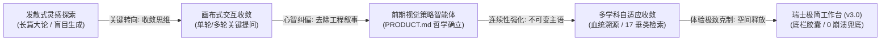
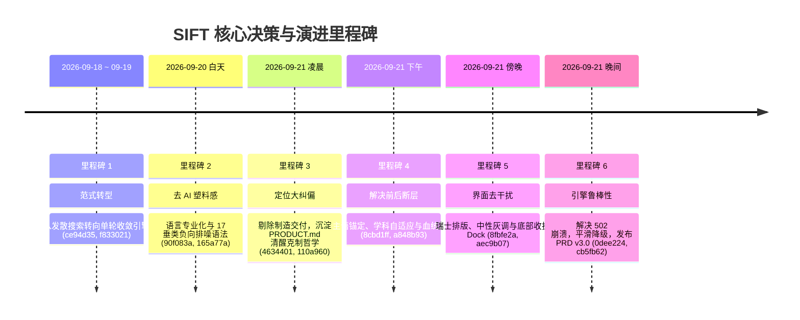
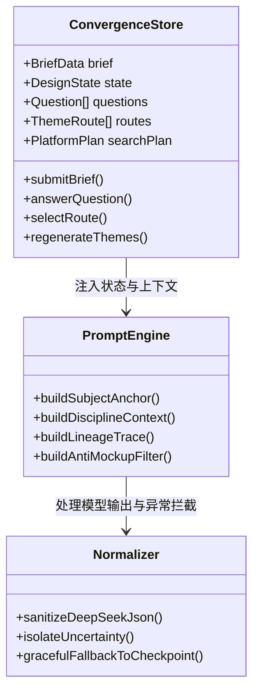

# SIFT 演进历程与关键决策全景复盘

> **项目名称**：SIFT (Veribox MVP)  
> **代码仓库**：`imLeyson/SIFT-Veribox`  
> **文档定位**：全周期研发日志、架构与产品决策演进复盘  
> **归档版本**：v3.0 阶段复盘（2026-09-21）  
> **当前状态**：已同步生产环境 (`https://veribox-mvp.vercel.app/`)，全量测试套件 100/100 绿灯通过

---

## 目录
1. [执行摘要与定位演进脉络](#1-执行摘要与定位演进脉络)
2. [产品哲学确立：清醒、好奇、克制与反向参考](#2-产品哲学确立清醒好奇克制与反向参考)
3. [六大里程碑与关键决策深度拆解](#3-六大里程碑与关键决策深度拆解)
   - [里程碑 1：范式转型（从“发散搜索”到“收敛引擎”）](#里程碑-1范式转型从发散搜索到收敛引擎)
   - [里程碑 2：去 AI 塑料感与设计师心智对齐](#里程碑-2去-ai-塑料感与设计师心智对齐)
   - [里程碑 3：定位大纠偏（剔除虚假落地，回归前期灵感）](#里程碑-3定位大纠偏剔除虚假落地回归前期灵感)
   - [里程碑 4：解决断层（主语锚定、学科自适应与血统溯源）](#里程碑-4解决断层主语锚定学科自适应与血统溯源)
   - [里程碑 5：界面去干扰（瑞士风格排版与底部智能胶囊 Dock）](#里程碑-5界面去干扰瑞士风格排版与底部智能胶囊-dock)
   - [里程碑 6：引擎鲁棒性闭环（消灭 502 崩溃与优雅降级）](#里程碑-6引擎鲁棒性闭环消灭-502-崩溃与优雅降级)
4. [核心演进前后全景对比矩阵](#4-核心演进前后全景对比矩阵)
5. [技术架构演进史（模型、状态机与视觉系统）](#5-技术架构演进史模型状态机与视觉系统)
6. [附录：Git 核心提交记录与决策索引表](#6-附录git-核心提交记录与决策索引表)

---

## 1. 执行摘要与定位演进脉络

SIFT 最初作为一个“设计探索 Agent 原型”启动，经历了从“发散式灵感生成器”到“设计收敛画布”，再到**“面向设计师的视觉策略与方向收敛智能体”**的本质蜕变。

在整个迭代周期中，产品团队做出了数次至关重要的定位纠偏与架构重塑：
- **拒绝浮躁生图**：坚决不接入 Midjourney/Stable Diffusion 做“效果图渲染”，将核心定位锁定在前期设计判断；
- **拒绝虚假交付**：彻底剥离“打样、模切、制造可行性评估”等伪装成执行阶段的假大空功能；
- **解决核心痛点**：专注解决设计师在 Day 0 阶段（拿到模糊 Brief 和零散参考图时），因方向过多而陷入“漫无目的翻图”的困境。

---

## 2. 产品哲学确立：清醒、好奇、克制与反向参考

在提交 `110a960` 中，项目首次正式沉淀了专属性设计规范 `PRODUCT.md`，从根本上锁定了产品的价值观与设计边界：

### 2.1 品牌性格（Brand Personality）
* **清醒（Sober）**：保持客观理性，不把假设包装成确定结论，不夸大 AI 的判断能力；
* **好奇（Curious）**：用高质量、对立的视觉提问激发设计师灵感，而不是强行塞给设计师答案；
* **克制（Restrained）**：无营销噱头、无浮夸动画，界面退后，将舞台完全留给视觉思考。

### 2.2 绝对禁止的反向参考（Anti-references）
* ❌ **不要做成项目管理看板**：不搞任务勾选催促执行；
* ❌ **不要做成制造可行性评估器**：不碰工厂打样、公差、模切和量产参数；
* ❌ **不要做成“完成度”仪表盘**：前期探索没有标准百分比，保留不确定性与多种可能；
* ❌ **不要宣称效果图渲染**：绝不进行概念效果图的自动化盲目堆砌。

### 2.3 核心设计原则
1. **每个探索动作都能回指 Brief 或已确认的收敛判断**；
2. **先提出可比较的视觉假设，再用视点把假设拆成观察问题**；
3. **搜索是为回答当前视点而收集视觉证据，不是无目的地堆积链接**；
4. **保留不确定性与多种可能，不把灵感阶段伪装成执行阶段**；
5. **让设计师随时知道当前卡片在收敛链条中的位置**。

---

## 3. 六大里程碑与关键决策深度拆解

---

### 里程碑 1：范式转型（从“发散搜索”到“收敛引擎”）
* **关键 Commit**：`ce94d35`、`04f3ad3`、`f833021`、`06c8c5b`
* **问题背景**：
  早期原型（Agent v1）试图一次性给用户生成 3~5 篇包含市场、人群、路线的长篇大论，设计师反馈“没有真正解决开局不知从何下手的问题，反而制造了阅读垃圾”。
* **重大决策**：
  1. **放弃发散，建立单轮/批量收敛画布（Convergence Canvas）**：通过识别当前 Brief 中最大的“不确定性”，生成 2~3 个具有对立审美品味的提问，逼迫方向收窄；
  2. **模型引擎迁移与输出规整**：从早期不稳定第三方接口迁移至 DeepSeek Flash 官方引擎，建立服务端/客户端双重 JSON 提取与容错校验，攻克了 `reasoning_content`（思考泄露）截断 JSON 的难题。

---

### 里程碑 2：去 AI 塑料感与设计师心智对齐
* **关键 Commit**：`90f083a`、`923cabf`、`165a77a`、`0f74c4d`、`c380680`
* **问题背景**：
  模型初期输出大量诸如“科技赋能”、“高端奢华”、“极致体验”等互联网套话；搜索关键词也极其泛化，给出的参考图包含大量低质营销样机。
* **重大决策**：
  1. **重构提示词语义空间（Art Direction Specs）**：
     - 禁止出现“卖点、商业价值、高端大气”等模糊词汇；
     - 强制输出“材质肌理、光影对比、骨架排版、表面工艺（如微珠哑光、无氟涂层、冷烫印）”等艺术指导术语；
  2. **多模态非图生图反推机制**：
     - 支持设计师上传参考图，但不做图生图；
     - 多模态模型仅用于“逆向解构”参考图的色彩键位、光泽质感与版式栅格，并提取出用于检索的专业关键词；
  3. **17 个设计垂直检索源与 `-mockup` 负向排噪语法**：
     - 接入 Behance Packaging、Dezeen Materials、Pinterest Tactile、Typewolf、Fonts in Use、Mindsparkle Mag 等垂类；
     - 所有生成的检索语法默认自动挂载 `-mockup -template -vector -stock -3d`，从根源上屏蔽免版税贴图干扰。

---

### 里程碑 3：定位大纠偏（剔除虚假落地，回归前期灵感）
* **关键 Commit**：`4634401`、`110a960`、`a5456cf`
* **问题背景**：
  产品中途曾一度引入“生产参数、工程可行性、模切规格、工厂打样进度”，导致界面变得像重型 ERP/制造管理工具。设计师强烈指出：“在方案初期的灵感收敛阶段，看这些不仅毫无帮助，还显得 AI 特别不专业，因为 AI 根本不懂实际工厂公差”。
* **重大决策（决定产品命运的拐点）**：
  1. **物理清空制造规格代码（Purge manufacturing specs）**：坚决删除了代码库中所有打样、公差、模切、工艺验收等虚假工程字段；
  2. **发布 `PRODUCT.md` 核心宪章**：界定 SIFT 专为 Day 0 的“视觉策略与方向收敛”服务，界面必须保持“清醒、好奇、克制”；
  3. **重定向卡片职责**：把后半段节点全部收敛回“视觉验证清单（Checklist）”与“视觉切片推演”，专注于帮助设计师形成提案依据。

---

### 里程碑 4：解决断层（主语锚定、学科自适应与血统溯源）
* **关键 Commit**：`8cbd1ff`、`a848b93`
* **问题背景**：
  用户在实际测试中反馈：*“主题和主题以后的内容，都跟前面的步骤偏离太多了，继续强化上下文，以及后面的连续性和相关性”*。例如输入的是“折叠水壶”，后面生成的主题跑偏成了“通用极简容器”，提问确认的材质倾向在最后一步被遗忘。
* **重大决策**：
  1. **实施“不可变主语锚定”（Immutable Subject Anchoring）**：
     - 系统在 Node 00 提取核心品类名词（如“可降解竹纤维咖啡渣随行杯”），在后续所有的 Stage 01、03、05、07 强行作为不可变主语注入 Prompt，绝不允许品类泛化；
  2. **跨学科自适应（Discipline-Adaptive Territories）**：
     - 自动识别学科分支：**实体硬件/可持续材料**、**包装/容器设计**、**界面/数字体验**、**品牌/VI 系统**；
     - 依据不同学科调取差异化的专业词库与检索平台（硬件偏向 Dezeen Materials，包装偏向 Behance Packaging）；
  3. **增加“血统溯源”（Provenance Lineage）面板**：
     - 在每个主题卡片中，显性展示三大溯源链条：
       - 📌 **Brief 锚点**：继承了最初的哪个核心主张；
       - ⚖️ **确认取舍**：吸纳了哪一轮岔路口提问的抉择结果；
       - 🛡️ **避坑防线**：坚决规避了哪些已声明的禁忌与雷区。

---

### 里程碑 5：界面去干扰（瑞士风格排版与底部智能胶囊 Dock）
* **关键 Commit**：`9b1da3f`、`4bac7bc`、`8fbfe2a`、`aec9b07`
* **问题背景**：
  用户接连提出两大界面体验痛点：
  1. *“界面太像生成效果图的，需要专业、克制一点”*；
  2. *“摆出来的位置太妨碍用户了，优化一下”*（原先左上方常驻的流程导航条遮挡了 Brief 卡片与选项）。
* **重大决策**：
  1. **瑞士国际主义极简美学落地**：
     - 全面剥离高饱和的黄色、红色装饰背景与营销类 Callout；
     - 确立冷灰中性极简调性（Neutral Slate/Zinc），依托 3px 顶部特征线（Accent line）做状态区分；
  2. **重构底部导航 Dock（CanvasNavDock）**：
     - **位置迁移**：从原先极易遮挡内容的左上方挪到**屏幕正下方居中（`bottom-center`）**；
     - **智能渐进收折**：
       - Stage 00（未开始前）：仅呈现为极小巧的透明胶囊 `[ 🧭 流程导航 ∧ ]`；
       - 点击开始收敛后：轻量展开各阶段圆点与快捷定位；
       - 点击 `[ ∨ ]` 按钮：可随时一键缩回，把 100% 画布全景留给设计师；
     - **清理无效入口**：移除了流程未启动时毫无意义的“导出提案”按钮，仅在全部收敛完成后才显露导出。

---

### 里程碑 6：引擎鲁棒性闭环（消灭 502 崩溃与优雅降级）
* **关键 Commit**：`df627ad`、`0dee224`、`cb5fb62`
* **问题背景**：
  在多轮对话中，当用户针对某一道提问选择“暂不确定”时，系统的判断逻辑曾误将当前轮次的所有问题全局判定为“已处理”，导致下一轮模型由于检测不到新的不确定性而抛出 `模型重复询问已处理的判断，请重试`，从而在前端引发 502 错误弹窗。
* **重大决策**：
  1. **精准 `questionId` 隔离**：重构了 Live Payload 正常化机制，将“暂不确定”严格精确地绑定到当前题目 ID，不污染全局状态；
  2. **优雅降级到 Checkpoint（Graceful Fallback）**：当用户多次选择不确定、或者模型判定当前方向已经收敛无需再做无谓提问时，系统不再报错，而是平滑输出 `next: { type: "checkpoint", reason: "ready" }`，引导设计师进入人工检查点；
  3. **固化 PRD v3.0**：全量重写产品需求文档与全链路流程规范，作为后续演进的黄金标准。

---

## 4. 核心演进前后全景对比矩阵

| 评估维度 | 早期版本 (v1.0 ~ v2.0) | 当前最新版本 (v3.0) | 决策背后的设计师洞察 |
| :--- | :--- | :--- | :--- |
| **产品心智** | 容易被误认为是“生成效果图”或“打样工具” | **纯粹的「视觉策略与方向收敛智能体」** | 设计师不需要 AI 画粗糙的效果图，需要的是理清思路与检索抓手 |
| **Brief 输入** | 自由多行文本框，容易输入模糊空洞词 | **标准化四段式引导** + 1 键填入规范模板 | 降低设计师组织语言的心理门槛，从源头锁定品类与禁忌 |
| **输入质量反馈** | 无反馈，直接触发生成 | **0~100 质量雷达动态诊断** | 明确告知缺少哪些要素（材质缺失/禁忌不明），引导补全 |
| **参考图处理** | 倾向于图生图或打普通标签 | **逆向工程拆解材质肌理与版式网格** | 提取核心视觉 DNA，坚决不进行无序生成 |
| **岔路口提问** | 随意生成 1~5 题，文字冗长、缺乏反差 | **严格限制 2~3 题，题干≤35字，选项具有强对立风格** | 每一道提问都必须具有“分水岭”意义，拒绝鸡毛蒜皮的琐碎问题 |
| **不确定性处理** | 点击“暂不确定”容易死循环崩溃 | **严格 QuestionId 隔离 + 平滑收敛降级** | 尊重设计师“前期保留探索空间”的心理，不强迫二选一 |
| **主题生成** | 通用词汇泛滥，后阶段与前阶段断层脱节 | **学科自适应 + 不可变主语 + 血统溯源面板** | 消除方案与 Brief 的割裂感，让每一个主题都有据可循 |
| **检索规划** | 堆砌宽泛词，搜索结果充斥大量免版税贴图 | **17 垂直设计源分权 + `-mockup` 排除语法** | 真正输出高级别设计总监水准的检索组合拳 |
| **界面交互** | 悬浮导航遮挡左侧视线，黄色营销高光刺眼 | **冷灰中性极简 + 底栏居中可折叠智能 Dock** | 去除视觉噪音，将 100% 空间与专注力归还给设计推演 |

---

## 5. 技术架构演进史（模型、状态机与视觉系统）

### 5.1 提示词与上下文连续性保障
- **主语不可变性（Subject Immortality）**：在系统级 Prompt 中定义 `immutableSubject`，禁止模型擅自将特定品类抽象为泛化大类；
- **防发散约束（Anti-Drift Guardrails）**：强制在生成主题时回溯已记录的 `positiveDecisions` 与 `negativeConstraints`；
- **排噪语法库（Negative Keyword Engine）**：内建 `-mockup -template -vector -stock -free -3d` 过滤词典。

### 5.2 状态机鲁棒性与异常隔离
- **请求隔离 ID 生成（Request-isolated IDs）**：为每个提问生成 `q_${requestId}_${index + 1}`，防止多轮追加提问时的 ID 碰撞；
- **原子性提交与迟到响应拦截**：用户切换选项或返回修改时，废弃正在在途中运行的旧请求，确保画布状态一致；
- **双端容错预算**：服务端单次请求预算 45 秒，客户端预算 50 秒，支持单次透明重试与手动取消。

---

## 6. 附录：Git 核心提交记录与决策索引表

以下按时间倒序列出代码库中具有里程碑意义的关键提交：

| Commit | 日期与时间 | 变更类型 | 提交说明（Subject） | 对应的设计与架构决策 |
| :--- | :--- | :--- | :--- | :--- |
| `cb5fb62` | 2026-09-21 20:51 | `docs` | update PRD and user flow specification to v3.0 | 全量归档 PRD v3.0，沉淀最新契约与流程 |
| `0dee224` | 2026-09-21 20:23 | `fix(agent)` | prevent false positive duplicate uncertainty crashes and ensure smooth convergence | 解决多轮暂不确定误报死循环，加入平滑收敛降级 |
| `aec9b07` | 2026-09-21 17:39 | `fix(ui)` | move canvas nav dock to bottom-center with collapsible pill | 将遮挡视线的导航迁移至底部居中，支持收折 |
| `8fbfe2a` | 2026-09-21 17:27 | `refactor(ui)`| streamline brief input header with restrained professional styling | 去除刺激性黄色 Callout，回归克制中性灰风格 |
| `a848b93` | 2026-09-21 17:19 | `fix(agent)` | enforce context continuity and discipline-adaptive creative territories | 彻底解决后阶段偏离前阶段痛点，增加血统溯源 |
| `5bf7c18` | 2026-09-21 16:57 | `feat(ux)` | optimize brief prompt structure and reinforce visual strategy convergence | 引入标准化四段式 Brief 句式与模板快捷填入 |
| `8cbd1ff` | 2026-09-21 15:37 | `feat(agent)`| enforce immutable subject anchoring and multi-domain adaptability | 强化不可变主语锚定，支持硬件/包装/界面多学科 |
| `dc8eb75` | 2026-09-21 15:27 | `fix(ux)` | eliminate emoji surrogate rendering bug and refine brief diagnostics copy | 修复字符乱码 Bug，优化 Brief 雷达诊断文案 |
| `df627ad` | 2026-09-21 14:12 | `fix(convergence)`| auto-preserve unreconsidered constraints during live turn normalization | 多轮交互中自动保留未修改的既定约束 |
| `a5456cf` | 2026-09-21 13:17 | `fix` | keep exploration copy free of execution cues | 全面净化探索文案，剔除落地执行暗示 |
| `110a960` | 2026-09-21 12:49 | `docs` | capture SIFT exploration product context | **里程碑**：沉淀 `PRODUCT.md` 清醒克制哲学与反向参考 |
| `52689a1` | 2026-09-21 12:32 | `feat(ux)` | optimize theme glanceability, add theme regeneration, default anti-mockup search | 优化主题一览性，支持单卡重新生成与防样机检索 |
| `4634401` | 2026-09-21 00:40 | `fix(workbench)`| refocus on early visual inspiration, purge manufacturing specs | **关键拐点**：彻底清除制造打样规格，回归灵感探索 |
| `34fe55e` | 2026-09-21 00:32 | `feat(flow)` | implement refined stage visual fingerprints with 3px top accent lines | 建立瑞士极简风格 3px 阶段特征识别线 |
| `4bac7bc` | 2026-09-21 00:18 | `refactor(07)`| strip flashy badges, emojis; embrace pure Swiss typography | 去除浮夸 Emoji 和复杂色块，纯粹字体排印 |
| `c380680` | 2026-09-21 00:13 | `feat(07)` | elevate to Director-Level Inspiration Exploration Instrument | 升级 07 节点为艺术总监级探索仪器 |
| `bb1bdec` | 2026-09-21 00:08 | `feat(sys1)` | integrate Jev System 1 search query calibration and hit-rate judgment | 引入 Jev System 1 搜索质量校准与命中率判定 |
| `0f74c4d` | 2026-09-21 00:00 | `refactor(theme)`| replace amateurish labels with art direction specs | 用专业艺术指导术语替换业余 AI 标签 |
| `165a77a` | 2026-09-20 22:50 | `feat(search)`| enrich design platforms to 17 top vertical sources | 扩充至 17 个设计垂类源，定制检索公式 |
| `96e43c6` | 2026-09-20 22:43 | `feat` | upgrade exploration routes to Design Themes with hero names | 将模糊路线升级为具象「设计主题」与视觉切片 |
| `923cabf` | 2026-09-20 20:00 | `feat` | add multimodal reference image recognition and visual keyword extraction | 引入多模态参考图解构（材质/网格/光泽识别） |
| `ce94d35` | 2026-09-19 18:00 | `feat` | add a single-turn design convergence engine | **里程碑**：从发散搜索全面转向设计方向收敛引擎 |

---

*本文档由 Antigravity 自动化复盘工具基于 GitHub 仓库真实提交记录与产品工程演进轨迹整理生成。*
