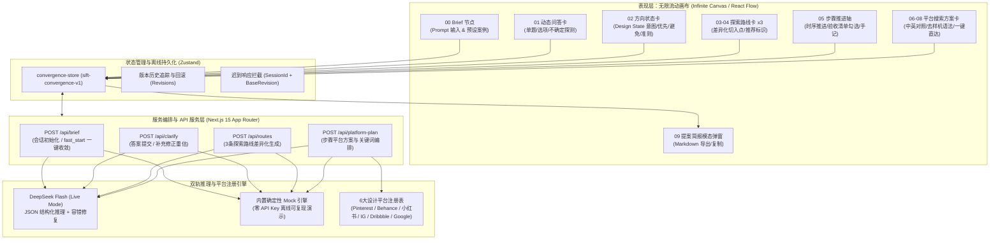
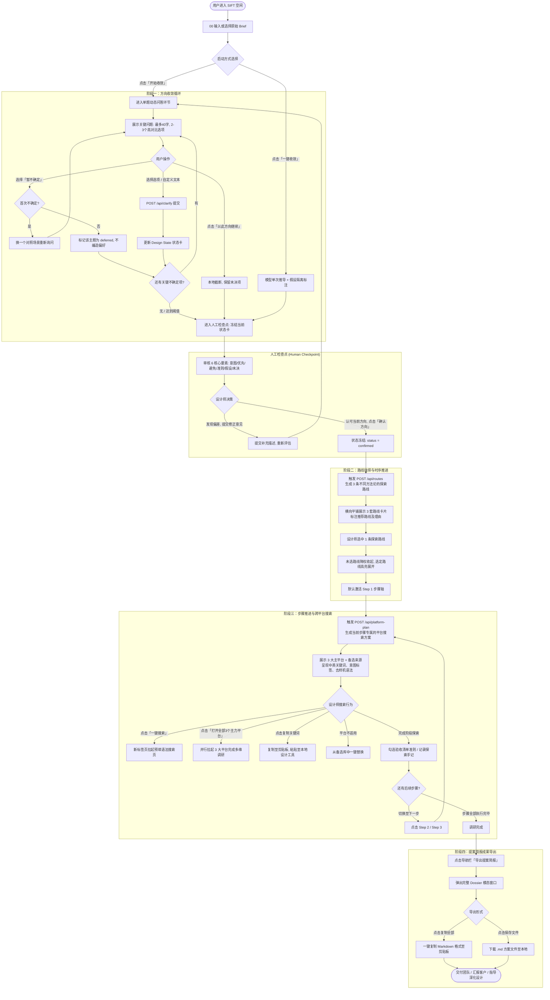
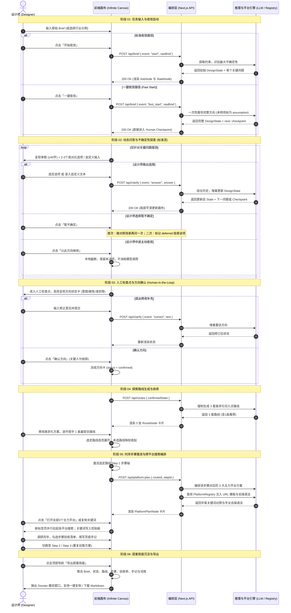
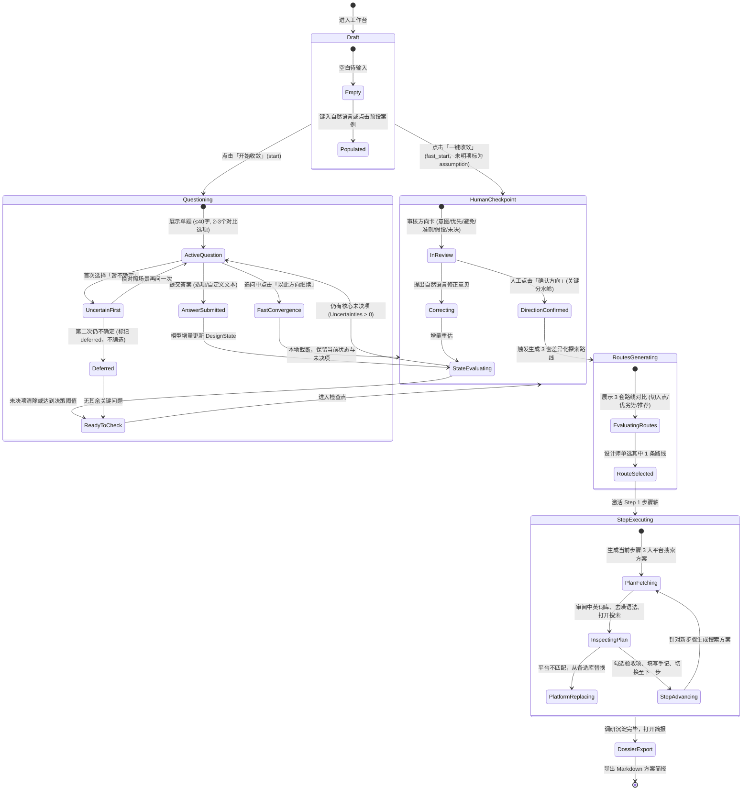

# SIFT：设计方向收敛与视觉探索 Agent
## 产品需求文档 (PRD v2.0) 与完整用户流程规范

**文档版本**：v2.0 (全闭环生产版)  
**产品代号**：SIFT (Design Convergence & Inspiration Exploration Agent)  
**文档状态**：正式发布 / 研发与设计基准  
**对应工程**：`veribox-mvp` (Next.js 15 App Router + React Flow + Zustand + DeepSeek Flash / Mock)  
**文档归属**：AI 在设计工作流中的重构实践  

---

## 目录
1. [执行摘要与问题洞察](#1-执行摘要与问题洞察)
2. [产品定位与人机分工原则](#2-产品定位与人机分工原则)
3. [目标用户与典型场景](#3-目标用户与典型场景)
4. [系统全景架构与技术方案](#4-系统全景架构与技术方案)
5. [完整端到端用户流程 (User Flow)](#5-完整端到端用户流程-user-flow)
   - 5.1 [全景业务流程图](#51-全景业务流程图)
   - 5.2 [四方人机协同泳道图](#52-四方人机协同泳道图)
   - 5.3 [核心状态机流转与决策机制](#53-核心状态机流转与决策机制)
   - 5.4 [阶段性操作流与异常分支拆解](#54-阶段性操作流与异常分支拆解)
6. [功能模块详细需求规范](#6-功能模块详细需求规范)
   - 6.1 [模块一：Brief 输入与双轨启动](#61-模块一brief-输入与双轨启动)
   - 6.2 [模块二：单题动态问答与不确定性探测](#62-模块二单题动态问答与不确定性探测)
   - 6.3 [模块三：方向状态卡与人工检查点 (Human Checkpoint)](#63-模块三方向状态卡与人工检查点-human-checkpoint)
   - 6.4 [模块四：3 套差异化探索路线生成与抉择](#64-模块四3-套差异化探索路线生成与抉择)
   - 6.5 [模块五：时序步骤推进与验收清单](#65-模块五时序步骤推进与验收清单)
   - 6.6 [模块六：多平台搜索编排与去噪关键词资产](#66-模块六多平台搜索编排与去噪关键词资产)
   - 6.7 [模块七：设计提案简报导出 (Dossier)](#67-模块七设计提案简报导出-dossier)
7. [数据模型与接口契约](#7-数据模型与接口契约)
8. [非功能性需求与系统质量边界](#8-非功能性需求与系统质量边界)
9. [产品演进路线图 (Roadmap)](#9-产品演进路线图-roadmap)

---

## 1. 执行摘要与问题洞察

### 1.1 背景来源
本产品规划与架构设计直接源自对一线设计工作流的深度研讨（《AI在设计工作中的应用探讨》）。设计团队与指导专家一致指出：
> **“在设计前期，找图本身并不占优势——互联网上不用花钱就能搜到海量素材。真正的痛点在于：如何重新编排设计师的动作，理清搜索次序，把模糊的需求收敛为清晰的设计判断。”**

### 1.2 传统设计前期流程痛点拆解
通过对传统设计调研流程的真实动作追踪，发现以下四大断层：
1. **任务理解与边界模糊**：拿到 Brief 后，设计师大脑中有初步设想，但不知道项目的最大不确定性是什么，常常混淆目标与技术约束。
2. **搜索时序混乱（动作无序）**：在 Pinterest、Behance、小红书等平台检索时，不知道“先搜什么、后搜什么”（先搜品类、风格、调性、竞品还是工艺？），缺乏结构化时序。
3. **平台与词汇生态屏障（信息噪音）**：
   - 中英文平台生态脱节：本土灵感看中文社媒，先锋视觉依赖海外平台，反复中英机翻导致专业词汇失真；
   - 样机贴图噪音：普通搜索词搜出大量无参考价值的商业样机（Mockup）和模版贴图，淹没真实工艺细节。
4. **决策不收敛与灵感散落**：无目的翻图导致信息过载，收藏夹堆积数以百计零散图片，却难以向团队和客户汇报明确的设计路线与推进依据。

---

## 2. 产品定位与人机分工原则

### 2.1 产品定位
**SIFT 是专为设计师打造的前期方向收敛与视觉探索编排 Agent (Design Convergence & Exploration Agent)。**
它不是自动生图工具，也不是替代设计师决策的“黑盒脑洞器”，而是**设计师的结构化思维脚手架**。

### 2.2 核心价值主张
> **“Agent 负责发散可能、梳理次序与降低认知负载；设计师负责关键判断、主观审美与最终抉择。”**

### 2.3 设计哲学与演进准则
- **准则一：先做小跑通，再嫁接做大**。MVP 优先实现闭环的文字理解、方向收敛与跨平台搜索编排，后续逐步嫁接图像反推、槽位造句与团队协同。
- **准则二：人在哪抉择，AI 在哪赋能**。必须设立绝对的人工检查点（Human Checkpoint），未经设计师批准，系统绝不擅自越级推导。
- **准则三：假设与事实严格隔离**。模型所作的推论必须打上待确认假设标记（`basis: "assumption"`），用户确认的决策标记为事实（`basis: "user"`），绝不隐瞒模型意图。
- **准则四：拒绝死循环与编造偏好**。用户表示“暂不确定”时，系统最多换一种对照方式再问一次；若仍无法决断，直接标记暂缓（`deferred`），严禁强迫用户或捏造答案。

---

## 3. 目标用户与典型场景

### 3.1 目标用户画像
1. **主设 / 资深设计师 (Design Lead / Senior Designer)**：需要快速拆解复杂、矛盾的商业需求，为团队制定清晰的调研路径和探索提案。
2. **独立设计师 / 自由职业者**：独立对接甲方，面对模糊或频繁变动的需方诉求，需要低成本、快速验证方向并生成结构化 Brief 汇报。
3. **设计专业师生 / 前沿探索者**：探索 AI 与传统设计方法论（如双钻模型、现代瑞士平面设计）的深度结合。

### 3.2 典型使用场景

| 场景分类 | 典型用户输入示例 | 核心痛点与需求 | SIFT 响应策略 |
| :--- | :--- | :--- | :--- |
| **场景 A：约束冲突型任务** | “我们要做一款极简冷泡茶包装，预算极其有限，但投资人要求必须有极高奢华感与艺术收藏价值。” | 预算与高端工艺存在直接冲突，不知道如何取舍。 | 优先定位约束冲突，抛出关键对比问题，引导设计师确定优先坚持项与妥协项。 |
| **场景 B：模糊探索型任务** | “想做一个面向 Z 世代的社区咖啡馆品牌视觉，调性要酷一点，没有更多信息。” | 需求极度宽泛，缺少风格锚点与细分受众。 | 启动动态追问或一键快速收敛，生成 3 套截然不同切入点的探索路线（如工业冷感 vs 潮玩社群 vs 治愈温润）。 |
| **场景 C：时序搜索与出海调研** | “已确定要做瑞士极简版式的科技企业年报，需要去 Behance 和海外设计站找成套排版案例。” | 普通搜索全是千篇一律的样机模板，缺少专业设计词汇与时序。 | 针对步骤动态生成双语关键词资产，自动注入 `-mockup` 高级去噪语法，一键直达专业检索。 |

---

## 4. 系统全景架构与技术方案

---

## 5. 完整端到端用户流程 (User Flow)

### 5.1 全景业务流程图

---

### 5.2 四方人机协同泳道图

---

### 5.3 核心状态机流转与决策机制

---

## 6. 功能模块详细需求规范

### 6.1 模块一：Brief 输入与双轨启动
- **节点标识**：`00 Brief 输入节点 (BriefInputNode)`
- **主要能力**：
  - 非结构化自然语言输入（中英文均可，20–2000字）；
  - 6 个跨行业典型案例预设（冷泡茶、护肤品、SaaS、咖啡馆、艺术装帧、约束冲突穿戴）；
  - 双轨启动：**标准收敛（识别不确定性，抛出关键问题）** 与 **一键收敛（单次推导，假设标记隔离，直达检查点）**。

### 6.2 模块二：单题动态问答与不确定性探测
- **节点标识**：`01 动态问答卡 (AskNode / QuestionBlock)`
- **主要能力**：
  - 每轮仅问 1 个核心问题（≤40字）；
  - 提供 2–3 个存在本质差异的对比选项 + 自由文本输入 + 暂不确定；
  - 优先级次序：先化解约束冲突，再定表达重点，最后澄清受众感知；
  - 抗死循环机制：暂不确定仅换问一次，仍不确定则标记为 `deferred`；
  - 追问中断收敛：支持一键「以此方向继续」，本地快速封存并推进。

### 6.3 模块三：方向状态卡与人工检查点 (Human Checkpoint)
- **节点标识**：`02 方向状态卡 (StateNode)`
- **主要能力**：
  - 6 核心板块：任务基准、硬性约束、核心意图、优先坚持、坚决避免、判断准则与未决项；
  - 严格溯源：区分 `user`（用户确认）与 `assumption`（模型推断）；
  - 人工检查点（Human Gate）：未经设计师主动确认，系统严禁自动推进路线生成；支持自然语言补充修正重估。

### 6.4 模块四：3 套差异化探索路线生成与抉择
- **节点标识**：`03-04 探索路线卡 x3 (RouteNode)`
- **主要能力**：
  - 强制生成 3 套路线，禁止空泛风格词（如“简约风”已被拦截）；
  - 必须具备互斥切入起点（`startingPoint`）；
  - 仅至多 1 条推荐路线并阐明理由；
  - 包含核心突破问题、核心优势、潜在风险、可行性评估与时序步骤；
  - 选中路线展开步骤轴，未选路线降权收起。

### 6.5 模块五：时序步骤推进与验收清单
- **节点标识**：`05 步骤推进轴 (StepNode)`
- **主要能力**：
  - 3–5 个时序推进步骤（探索目的、交付物清单）；
  - 可交互勾选的验收清单（Acceptance Criteria）；
  - 步骤灵感手记（Notes）录入与持久化。

### 6.6 模块六：多平台搜索编排与去噪关键词资产
- **节点标识**：`06-08 平台搜索方案卡 (PlatformPlanNode)`
- **主要能力**：
  - 针对步骤动态生成 6 大设计平台（Pinterest, Behance, 小红书, IG, Dribbble, Google）搜索策略；
  - 中英双语对照与意图分类（`moodboard` / `detail` / `consumer` / `benchmark`）；
  - 高级去噪语法集成（如 Behance 自动注入 `-mockup` 过滤样机贴图）；
  - 一键新窗口直达、批量并行拉起 3 主力平台、备选来源无缝替换。

### 6.7 模块七：设计提案简报导出 (Dossier)
- **节点标识**：`09 提案简报导出 (DossierModal)`
- **主要能力**：
  - 聚合 Brief、收敛状态、选定路线、步骤进度、验收勾选、手记与搜索词库；
  - 一键复制 Markdown 格式至剪贴板，支持下载 `.md` 文件。

---

## 7. 数据模型与接口契约

系统严格基于以下核心 TypeScript 契约运行：
- `DesignState`：方向收敛状态机模型，包含版本号、状态、约束与判断数组（含 `basis: "user" | "assumption"` 溯源）。
- `Uncertainty`：不确定性模型，包含影响等级与 `open | deferred` 状态。
- `Route` & `RouteStep`：探索路线模型，包含切入点、优劣势、推荐理由与步骤清单。
- `PlatformPlan` & `PlatformSource` & `PlatformKeyword`：平台搜索编排模型，包含中英对照、意图标签与去噪语法。

---

## 8. 非功能性需求与系统质量边界

1. **双轨架构设计 (Live / Mock Dual-Engine)**：支持接入 DeepSeek Flash 实时大模型结构化推理；同时内置确定性离线 Mock 引擎，零 Key 环境下 100% 跑通全部流程。
2. **服务端容错与超时预算**：单次调用服务端 45s、客户端 50s 严格预算，内建轻微残缺 JSON 容错修补。
3. **状态幂等与并发防脏写**：基于 `(sessionId, requestId, baseRevision)` 严格拦截迟到网络响应。
4. **本地持久化与数据隔离**：Zustand 自动同步至 LocalStorage 键 `sift-convergence-v1`，保障草稿防丢失。
5. **瑞士极简设计规范**：杜绝花哨动效与大面积高饱和色彩，采用严谨的网格排版与克制微交互。

---

## 9. 产品演进路线图 (Roadmap)

- **Phase 1（当前已落地）**：文字理解与动作编排、双轨启动、单题问答、方向状态卡与检查点、3 套路线抉择、步骤轴与去样机多平台搜索方案、简报导出。
- **Phase 2（近程规划）**：灵感素材轻量沉淀、外部图片一键收藏卡、AI 以图反推风格流派与提示词结构（Reverse Prompting）、百张级灵感聚类分析报告。
- **Phase 3（远期展望）**：语法化槽位造句（将主谓宾语法映射为「风格 + 核心元素 + 视觉调性」拖拽拼装）、多人实时协同画布、团队评审分歧标记。
