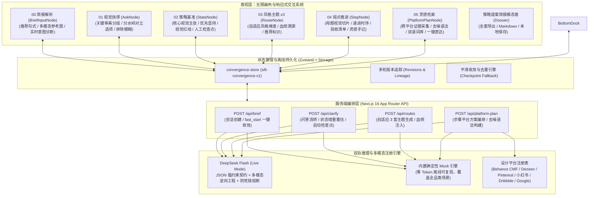
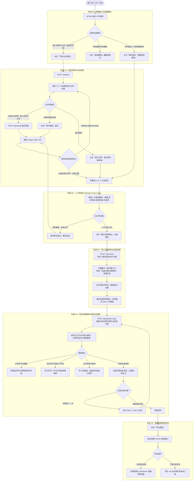
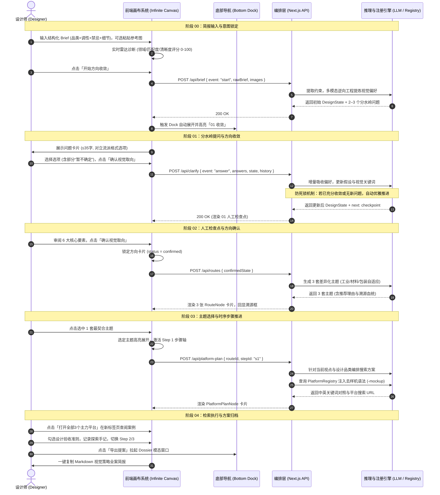
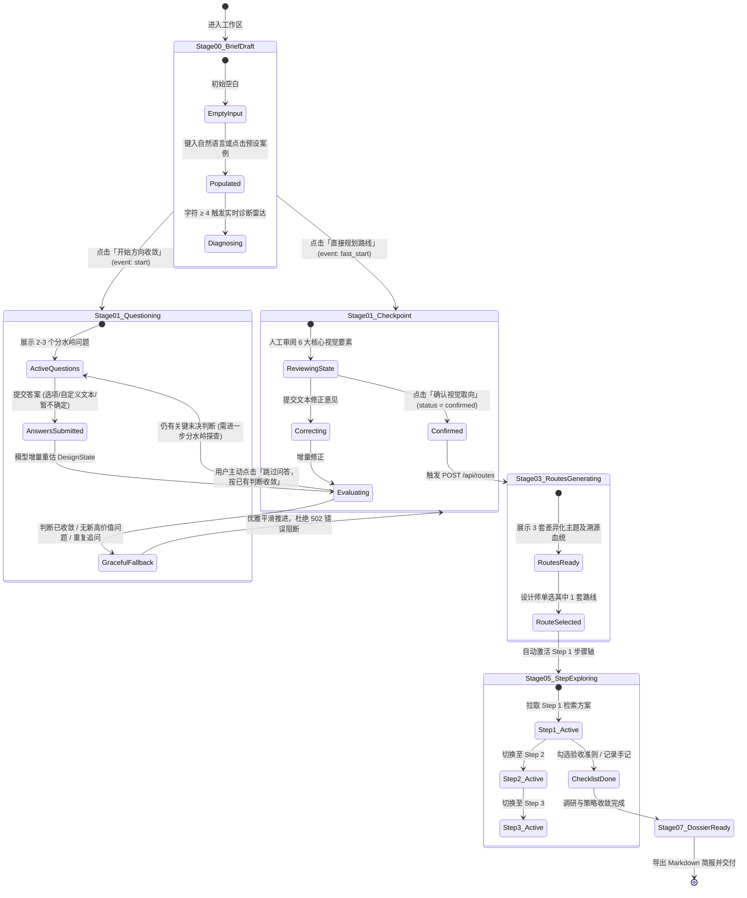
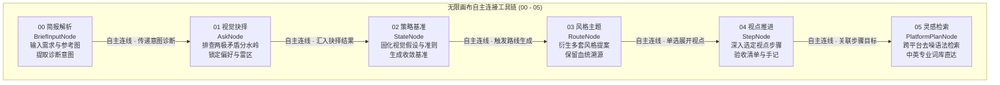
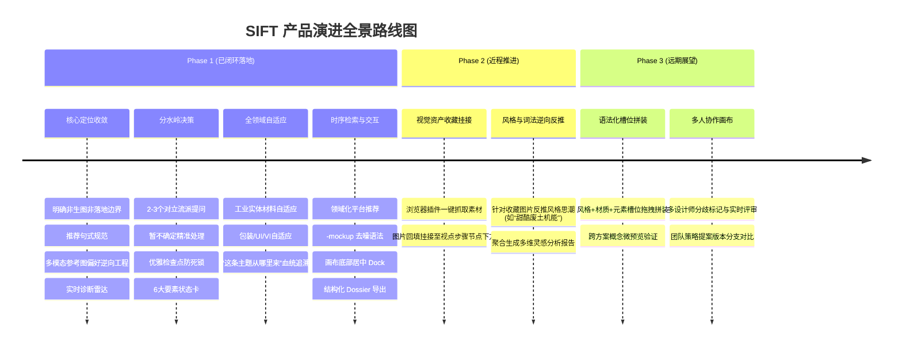

# SIFT：视觉策略与方向收敛智能体
## 产品需求文档 (PRD v3.0) 与完整用户流程规范

**文档版本**：v3.0 (视觉策略收敛与全领域自适应生产版)  
**产品代号**：SIFT (Visual Strategy & Direction Convergence Agent)  
**最新更新**：2026-09-21  
**文档状态**：正式发布 / 研发与设计基准  
**对应工程**：`veribox-mvp` (Next.js 16 App Router + React Flow + Zustand + DeepSeek Flash / Mock)  
**文档归属**：AI 在设计工作流中的重构实践  

---

## 目录
1. [执行摘要与问题洞察](#1-执行摘要与问题洞察)
2. [产品定位、核心边界与人机分工](#2-产品定位核心边界与人机分工)
3. [目标用户与典型场景](#3-目标用户与典型场景)
4. [系统全景架构与技术方案](#4-系统全景架构与技术方案)
5. [完整端到端用户流程 (User Flow)](#5-完整端到端用户流程-user-flow)
   - 5.1 [全景业务流程图](#51-全景业务流程图)
   - 5.2 [四方人机协同时序泳道图](#52-四方人机协同时序泳道图)
   - 5.3 [核心状态机流转与平滑收敛决策机制](#53-核心状态机流转与平滑收敛决策机制)
   - 5.4 [无限画布工具卡片自主连接与探索流](#54-无限画布工具卡片自主连接与探索流)
6. [功能模块详细需求规范](#6-功能模块详细需求规范)
   - 6.1 [模块一 (Node 00)：00 简报解析 · 视觉意图输入 (BriefInputNode)](#61-模块一node-0000-简报解析--视觉意图输入-briefinputnode)
   - 6.2 [模块二 (Node 01/02)：01 视觉抉择与 02 策略基准 (AskNode / StateNode)](#62-模块二node-010201-视觉抉择与-02-策略基准-asknode--statenode)
   - 6.3 [模块三 (Node 03)：03 风格主题与血统溯源 (RouteNode)](#63-模块三node-0303-风格主题与血统溯源-routenode)
   - 6.4 [模块四 (Node 04)：04 视点推进与实操验收 (StepNode)](#64-模块四node-0404-视点推进与实操验收-stepnode)
   - 6.5 [模块五 (Node 05)：05 灵感检索与去噪词库 (PlatformPlanNode)](#65-模块五node-0505-灵感检索与去噪词库-platformplannode)
   - 6.6 [核心交互原则：纯粹无限画布与卡片自主连接驱动](#66-核心交互原则纯粹无限画布与卡片自主连接驱动)
   - 6.7 [提案沉淀 (Dossier)：视觉策略提案简报沉淀与导出](#67-提案沉淀dossier视觉策略提案简报沉淀与导出)
7. [数据模型与接口契约](#7-数据模型与接口契约)
8. [非功能性需求与系统质量边界](#8-非功能性需求与系统质量边界)
9. [产品演进路线图 (Roadmap)](#9-产品演进路线图-roadmap)

---

## 1. 执行摘要与问题洞察

### 1.1 背景来源
本产品规划与架构设计直接源自对一线设计工作流的深度调研。设计团队与指导专家一致指出：
> **“在设计前期，找图本身并不占优势——互联网上不用花钱就能搜到海量素材。真正的痛点在于：如何重新编排设计师的动作，理清搜索次序，把模糊的需求收敛为清晰、有画面感的设计判断，避免前期漫无目的地试错。”**

### 1.2 传统设计前期流程四大断层
1. **意图与边界模糊**：拿到一段模糊简短的 Brief 或几张零散参考图后，设计师大脑中虽有初步感受，但无法明确项目的最大不确定性是什么，常常混淆核心视觉诉求与物理技术约束。
2. **AI 工具的定位误导（“生图幻觉”）**：市场上大量工具试图用 Midjourney / Stable Diffusion 一键生成效果图，但设计前期不需要、也不能依赖空洞且无法落地的“概念渲染图”。设计师需要的是清晰的**视觉策略、设计主张与检索方向**。
3. **平台与词汇生态屏障（信息噪音）**：
   - 搜图过程缺乏结构化时序：先搜材质、流派、调性，还是先搜布局结构？
   - 商业样机贴图泛滥：在 Behance、Pinterest 等平台检索时，搜出大量千篇一律的贴图样机（Mockup），掩盖了真实材质工艺与排版细节。
4. **决策不收敛与灵感散落**：无目的漫游翻图导致灵感碎片化，收藏夹堆积数以百计零散图片，却难以向团队和客户汇报明确的设计路线、推进依据与血统溯源。

---

## 2. 产品定位、核心边界与人机分工

### 2.1 产品定位
**SIFT 是一款面向专业设计师的视觉策略与方向收敛智能体 (Visual Strategy & Direction Convergence Agent)。**

它的目标是：**当你拿到一段模糊的 Brief 或几张参考图时，通过几轮关键的视觉分水岭提问，快速收敛出清晰、有画面感的设计主题与检索方向，避免前期漫无目的地试错。**

### 2.2 核心边界（坚决不做的范围）
- **坚决不做自动生图 / 渲染交付工具**：SIFT 不输出最终效果图、渲染图、生产施工图或 3D 打印切片。前期策略探索绝不越俎代庖替代落地交付。
- **坚决不做项目管理看板或打样合规仪表盘**：保持纯粹的设计工具心智，杜绝形式主义项目管理指标。
- **绝不替设计师做最终美学抉择**：AI 负责发散可能性、建立分水岭对比并理清搜索次序；设计师始终掌握关键判断与最终拍板权。

### 2.3 人机分工与设计哲学
| 角色 | 核心职责 | 输出物 |
| :--- | :--- | :--- |
| **SIFT Agent** | 结构化拆解需求、逆向工程参考图偏好、提炼视觉分水岭问题、推导画面感假设、编排跨平台去噪检索策略 | 结构化提问、Design State、3 套差异化主题领地、时序步骤、去噪搜索方案 |
| **设计师 (Human)** | 明确商业意图、权衡分水岭选项、提供主观审美偏好、拍板探索路线、执行真实世界调研 | 选项抉择、路线决策、验收清单确认、灵感手记记录 |

- **准则一：全领域自适应（Discipline-Adaptive）**：摒弃单一平面排版偏见，自动识别产品/材质、包装、UI/界面、品牌/VI 等不同载体，提炼该领域专属的工艺、造型与材质策略。
- **准则二：假设与事实严格隔离**：模型推论打上 `basis: "assumption"`（待确认），用户确认内容打上 `basis: "user"`（事实）。
- **准则三：拒绝死循环与强制提问**：用户选择“暂不确定”时精准保留未决状态；当视觉主张已充分收敛时，系统优雅推进至检查点，严禁死锁阻断。
- **准则四：克制专业的视觉语言**：界面采用中性石灰色调、严谨网格与微交互，剔除所有营销式警示框。

---

## 3. 目标用户与典型场景

### 3.1 目标用户画像
1. **工业/产品/CMF 设计师**：面对环保材料、新型工艺、实体伴侣器物等前沿需求，需要从模糊概念中理清材质触感、加工方式与形态隐喻。
2. **包装与品牌设计师**：面对“要高端但预算有限”、“要极简但有辨识度”等冲突型 Brief，需要确立视觉层级、材质工艺与包装开箱仪式感。
3. **UI / 数字界面设计师**：需要确立数字工作台或界面的信息架构密度、暗色机能调性或微交互质感。
4. **设计总监 / 独立设计顾问**：需要快速向客户汇报一套具备严密推导逻辑与血统追溯的视觉策略提案（Dossier）。

### 3.2 典型使用场景

| 场景分类 | 典型用户输入示例 | 核心痛点 | SIFT 响应策略 |
| :--- | :--- | :--- | :--- |
| **实体产品与可持续材质** | “我想做一个宠物毛发的可持续设计产品，具有情感设计，加工成可用新材料。” | 概念先锋但缺少工程感知，传统 AI 容易漂移到平面 Logo。 | 锁定工业与 CMF 领域，提问聚焦微纤维机理与天然粘结剂，生成【原生纤维·触感转化】、【情感器物·陪伴隐喻】等实体主题，平台直达 Dezeen 材料报道与 Behance CMF。 |
| **约束冲突型包装设计** | “我想做一个冷泡茶包装设计，希望整体克制日常，避免大插画与传统红金罐，探索特种纸微触感。” | 预算有限与高端质感冲突，不知如何在正面排版与特种工艺间取舍。 | 抛出视觉层级分水岭选择，收敛出【纯净特种纸微触感】路线，规划 Pinterest 纸张工艺与小红书实拍质感检索。 |
| **先锋界面与机能美学** | “领克 03+ 下一代性能车座舱内饰数字化界面方案，强化赛道机能与德式理性。” | 需求要素繁多，容易陷入千篇一律的仪表盘模板。 | 锁定横向拉伸视觉带与非对称环抱式布局，输出具象色号与界面负空间比例，规划先锋数字平台检索。 |

---

## 4. 系统全景架构与技术方案



---

## 5. 完整端到端用户流程 (User Flow)

### 5.1 全景业务流程图



---

### 5.2 四方人机协同时序泳道图



---

### 5.3 核心状态机流转与平滑收敛决策机制



---

### 5.4 无限画布工具卡片自主连接与探索流



---

## 6. 功能模块详细需求规范

### 6.1 模块一 (Node 00)：00 简报解析 · 视觉意图输入 (BriefInputNode)
- **节点标识**：`00 简报解析 (BriefInputNode)`
- **视觉层级与克制表达**：
  - 彻底移除高饱和度黄色营销警示框，采用中性微字阶辅助说明：`聚焦前期视觉策略与检索方向收敛 · 非生图交付工具`。
  - 顶部明确 Stage 标识：`00 简报解析 · 视觉意图输入`。
- **推荐句式规范与一键套用**：
  - 内嵌轻量浅灰推荐条：`推荐结构：我想做一个【品类】，希望【调性】，避免【禁忌】…` 搭配右侧 `[套用模板]` 按钮。
  - 点击一键注入四段式标准句式：`我想做一个【设计品类】，希望整体呈现【核心视觉调性与受众感受】，避免【明确的视觉禁忌与常见套路】，重点探索【材质工艺、排版结构或细节】。`
- **多模态参考图逆向工程**：
  - 支持本地选择文件、拖拽上传，或全局截图直接粘贴（⌘V）。
  - 文案严谨声明：`意向参考图 (可选，用于提炼材质与排版偏好，非垫图渲染)`。
  - 模型接收到图片后，执行色彩、网格负空间、材质肌理的逆向工程提取，并在提问中显式引用参考图中的视觉现象。
- **实时简报诊断雷达**：
  - 字符长度 ≥ 4 字符时触发前端纯静态轻量解析（延迟 <5ms），展示品类领域标签（如“包装 / 容器造型”、“实体产品 / 可持续材质”）、匹配度百分比、诉求清晰度评分（0–100），并动态给出极简提示。

---

### 6.2 模块二 (Node 01/02)：01 视觉抉择与 02 策略基准 (AskNode / StateNode)
- **节点标识**：`01 视觉抉择 (AskNode)` 与 `02 策略基准 (StateNode)`
- **批次分水岭提问机制 (01 视觉抉择)**：
  - 每轮必须提出 2–3 个高对比度问题，按 blocking > material > minor 排序。
  - 题干极精炼（≤35 字），选项 2–3 个（每项 ≤32 字），严格采用「流派/手法：具象取舍」对立格式（例如：“单色微字阶：仅保留单行品名与技术标尺，其余留白” vs “风味图示化：以局部几何色块突出茶品辨识度”）。
  - 支持每题单选、自定义输入或选择“暂不确定”。
- **“暂不确定”精准处理**：
  - 严格将用户答案与对应题目的 `questionId` 映射匹配。选“暂不确定”的题目保持未决状态，不强制推导虚假偏好，更不将其他题目的锁定状态误施加于该题。
- **平滑收敛降级机制 (Graceful Checkpoint Fallback)**：
  - 当模型检测到方向已经收敛、或后续轮次中无更多高价值新问题时，系统自动将当前累积的全部偏好持久化并推进至人工检查点，严禁抛出中断性系统异常。
- **02 策略基准核心要素**：
  1. `brief`: 目标、受众、交付媒介。
  2. `constraints`: 约束列表（明确标注 `user` 事实或 `assumption` 待确认假设，附带 `sourceIds` 追溯）。
  3. `direction`: 核心视觉主张 `intent`、坚持偏好 `priorities`、审美雷区 `avoid`、评价准则 `criteria`。
  4. `currentHypothesis`: ≤120 字、具象且富有画面感的当前设计假设。
  5. `validationAction`: 10–20 分钟内设计师可直接在电脑或工位上实操的轻量对照动作。
- **人工检查点确认**：提供“提出修正意见”与“确认基准，生成风格主题”，基准确认后（`status = "confirmed"`）不可随意回退，作为下阶段路线生成的绝对地基。

---

### 6.3 模块三 (Node 03)：03 风格主题与血统溯源 (RouteNode)
- **节点标识**：`03 风格主题 (RouteNode x 3)`
- **全领域自适应设计主题 (Discipline-Adaptive Territories)**：
  - **产品与实体材质类**：自动收敛为材质探索维度（例如：【原生纤维 · 触感转化】、【情感器物 · 陪伴隐喻】、【现代极简 · 日常共生】），深入毛发微纤维机理、天然粘结剂、粗砺哑光触感与功能载体，彻底杜绝强加 2D 平面排版。
  - **包装与容器类**：收敛为特种纸微触感、容器骨架、风味标尺排版与开箱仪式感。
  - **数字与界面类**：收敛为高密度数据架构、暗色极客机能、非对称环抱式布局。
  - **品牌与 VI 类**：收敛为极简几何轮廓、纯字体微标尺、先锋色彩对撞。
- **“这条主题从哪里来”血统溯源卡片 (Lineage Box)**：
  - 每套主题下方均渲染专属的溯源框，清晰呈现：
    - 用户原始 Brief 意图锚点；
    - 已确认的视觉坚持（Confirmed Priorities，如“触觉感知优先”、“真实物料实验”）；
    - 明确避开的视觉雷区（Avoided Traps，如“拒绝过度包装噱头”、“杜绝模板化”）。
- **推荐标识与单选高亮**：
  - 模型标注 1 条首选推荐路线并给出客观理由；
  - 设计师点击选中其中 1 条路线后，该路线高亮并展开下游 04 视点推进卡片，其余路线降权淡化。

---

### 6.4 模块四 (Node 04)：04 视点推进与实操验收 (StepNode)
- **节点标识**：`04 视点推进 (StepNode)`
- **母题切片与连续性回显**：卡片显著回显它所归属的母主题名称与视觉切片定义，确保设计师明确当前步骤在全案中的上下文定位。
- **递进式 3 步时序轴**：
  - 针对选定主题，拆解为递进的视觉视点（如 Step 1 材料配比试验 -> Step 2 伴侣器物形态试验 -> Step 3 场景功能共生）。
- **具象设计验收清单 (Checklist)**：
  - 针对每个步骤提供 2–3 条客观可评判的视觉验收标准（支持手动复选勾选，实时计算达成百分比）。
- **实操灵感手记 (Notes)**：
  - 提供即时文本输入区域，允许设计师随手记下调研灵感，手记内容自动持久化并整合进最终提案简报。

---

### 6.5 模块五 (Node 05)：05 灵感检索与去噪词库 (PlatformPlanNode)
- **节点标识**：`05 灵感检索 (PlatformPlanNode)`
- **领域化平台权重自适应**：
  - 实体产品/材质方案：优先规划 **Dezeen 材料报道**、**Behance 工业设计与 CMF**、**Pinterest 特种材料质感**。
  - 包装方案：优先规划 Behance Packaging、Pinterest Packaging、小红书实拍。
  - 界面方案：优先规划 Dribbble UI、Mobbin、Behance UI/UX。
- **高级去噪负向语法注入**：
  - 自动在检索式中注入 `-mockup -template -vector` 等高级负向排除语法，剔除商业样机贴图与空洞矢量素材。
- **中英双语专业设计词库**：
  - 输出英文标准术语（如 `recycled hair fiber product design`、`tactile composite CMF`）搭配中文意图说明。
- **检索动作直达**：
  - 提供“一键搜索”（新标签页打开预填语法的搜索页）；
  - 提供“打开全部3个主力平台”（并行拉起 3 大平台完成多维调研）；
  - 提供一键复制关键词到剪贴板。

---

### 6.6 核心交互原则：纯粹无限画布与卡片自主连接驱动
- **画布为产品绝对核心**：
  - 彻底取消悬浮底部 Dock（`CanvasNavDock`），将全部视听焦点归还给无限画布与视觉探索空间。
  - 所有 Agent 交互和决策均直接在画布上的卡片内部完成，卡片即工具。
- **00-05 卡片自主连接与上下文读取机制**：
  - 每个卡片具备标准输入输出 Dock 锚点，动态渲染呼吸动效发光连线。
  - 下游卡片自主读取上游卡片的上下文（例如 01 视觉抉择读取 00 简报与诊断；02 策略基准读取已锁定答案；03 风格主题读取策略基准；04 视点推进读取所选主题；05 灵感检索读取视点目标）。
- **工作区全局沉淀**：
  - 导出提案（Dossier）常驻在顶部工作台操作栏，在需要汇报总结时一键唤出，绝不遮挡画布操作。

---

### 6.7 提案沉淀 (Dossier)：视觉策略提案简报沉淀与导出
- **组件标识**：`DossierModal.tsx` 与 `export-dossier.ts`
- **内容结构聚合**：
  1. 简报基础信息（原始 Brief、行业领域诊断、多模态参考图分析）；
  2. 锁定视觉主张（意图、坚持偏好、视觉雷区、评价准则、当前视觉假设、实操验证动作）；
  3. 选定设计主题（核心理念、切入点、优劣势、血统溯源证明）；
  4. 深入探索视点（各步骤目标、验收准则达成率、设计师灵感手记）；
  5. 跨平台去噪检索词库（各平台中英关键词汇总与直达链接）。
- **方案免责与边界声明**：文末明确标注：`由 SIFT 生成 · 面向设计师的视觉策略与方向收敛智能体 · 快速收敛清晰有画面感的设计主题与检索方向，避免前期漫无目的地试错（不涉及后期落地交付与生图）`。
- **导出方式**：支持一键复制完整 Markdown 至剪贴板，或下载本地 `.md` 文件。

---

## 7. 数据模型与接口契约

### 7.1 核心数据结构 (Zod Schemas)

```typescript
// 1. 核心判断条目
export interface Judgment {
  text: string;
  basis: "user" | "assumption";
  sourceIds: string[];
}

// 2. 核心方向状态
export interface DesignState {
  revision: number;
  status: "questioning" | "checkpoint" | "confirmed";
  brief: {
    goal: string | null;
    audience: string | null;
    deliverable: string | null;
  };
  constraints: Judgment[];
  direction: {
    intent: Judgment | null;
    priorities: Judgment[];
    avoid: Judgment[];
    criteria: Judgment[];
  };
  currentHypothesis: string | null;
  validationAction: {
    label: string;
    instruction: string;
  } | null;
  uncertainties: {
    id: string;
    topic: string;
    impact: "blocking" | "material" | "minor";
    decisionAffected: string;
    status: "open" | "deferred";
  }[];
  visualKeywords: string[]; // 4–6 个具象参数
}

// 3. 探索主题路线
export interface Route {
  id: string;
  title: string;
  themeName?: string;
  focusDimension?: string;
  description: string;
  tradeoffs: string;
  recommended?: boolean;
  provenance?: {
    briefAnchor?: string;
    confirmedPriorities?: string[];
    avoidedTraps?: string[];
  };
  steps: {
    id: string;
    title: string;
    question: string;
    purpose: string;
    done?: boolean;
  }[];
}

// 4. 平台检索方案
export interface PlatformPlan {
  id: string;
  routeId: string;
  stepId: string;
  primarySources: {
    platform: "behance" | "pinterest" | "dezeen" | "xiaohongshu" | "dribbble" | "google";
    role: string;
    keywords: string[];
    searchQuery: string;
    searchUrl: string;
  }[];
  alternativeSources: {
    platform: string;
    role: string;
    keywords: string[];
    searchQuery: string;
    searchUrl: string;
  }[];
}
```

### 7.2 API 服务契约规范

| 接口路由 | 方法 | 对应流程 | 输入核心参数 | 输出核心模型 | 核心防错与设计保证 |
| :--- | :--- | :--- | :--- | :--- | :--- |
| `/api/brief` | `POST` | 阶段 00 初始化 | `rawBrief`, `images`, `sessionId`, `event: "start" \| "fast_start"` | `TurnResult (state, next)` | `fast_start` 保证返回 Checkpoint 并标注假设；支持多模态参考图传递 |
| `/api/clarify` | `POST` | 阶段 01 问答推进 | `sessionId`, `event: "answer"`, `answers: Answer[]`, `state`, `history` | `TurnResult (state, next)` | 精准题号匹配；防死锁与 ID 碰撞隔离；方向就绪时优雅推进检查点 |
| `/api/routes` | `POST` | 阶段 03 主题推导 | `confirmedState`, `history`, `rawBrief`, `refreshIndex` | `{ routes: Route[3] }` | 全领域自适应（工业材料/包装/UI/VI）；注入血统追溯信息；标注 1 项推荐 |
| `/api/platform-plan`| `POST`| 阶段 04 检索规划 | `routeId`, `stepId`, `selectedRoute`, `focusDimension`, `state` | `PlatformPlan` | 动态匹配适合该领域的 3 大平台；自动注入 `-mockup` 去噪语法与双语词库 |
| `/api/status` | `GET` | 系统探活 | 无 | `{ status: "ok", mode: "live" \| "mock" }` | 监控 LLM API 连通性与运行模式 |

---

## 8. 非功能性需求与系统质量边界

1. **防死锁与弹性容错架构 (Zero-Deadlock Fault Tolerance)**：
   - 杜绝因大模型重复已有判断或泛型 ID 碰撞向用户抛出 502 致命异常。在问答轮次中遇到决策闭环时，系统自动优雅降级为进入人工检查点。
2. **迟到网络回调与时序防护 (Race Condition Guard)**：
   - 每次网络交互携带 `(sessionId, requestId, revision)` 标识锁，当用户切换主题或重新发起任务时，自动丢弃旧异步回调，杜绝数据脏写与画布节点跳动。
3. **数据隐私与全量本地持久化**：
   - 画布全量数据本地持久化于浏览器 `LocalStorage`（Key: `sift-convergence-v1`），支持跨页面刷新无损恢复画布节点位置、选择项与手记。
4. **性能预算与交互响应**：
   - 前端静态诊断与收敛计算延迟 < 10ms；
   - 服务端大模型复杂推导超时上限严格控制在 45s 以内，具备轻度残缺 JSON 自动修复补全能力。
5. **专业克制的设计语言与无障碍标准**：
   - 界面严格遵循中性石灰色板（`stone` / `cream` / `accent`），不滥用饱和色背景与营销弹窗；
   - 严格遵循 WCAG 2.1 AA 标准，交互元素完全支持键盘 Tab 导航与快捷键操作（如 `⌘↵` 提交简报），支持系统 `prefers-reduced-motion` 动效减弱。

---

## 9. 产品演进路线图 (Roadmap)



### 9.1 Phase 2：视觉素材收藏挂接与以图反推词法（近程）
- **素材回填挂接 (Visual Asset Bookmarking)**：在 Behance、Dezeen 或 Pinterest 查阅案例时，支持通过轻量插件或图片拖拽，将灵感图挂接到对应步骤的节点下方。
- **图像风格逆向反推 (Style Reverse Engineering)**：AI 自动识别收藏图片的流派特征、色彩基调与表面工艺，提炼为可复用的关键词资产。

### 9.2 Phase 3：槽位式概念拼装与多人协作（远期）
- **语法化槽位拼装（Slot-based Composition）**：将设计维度抽象为「核心母题 + 材质工艺 + 空间骨架 + 视觉调性」槽位，允许设计师拖拽素材模块快速组合多套概念雏形。
- **多人协同画布 (Multiplayer Strategy Canvas)**：支持设计团队多人同时在线讨论分歧、标记决策依据，直接向业务方进行动态策略推演汇报。

---

*文档编写完成 · 经严格工程实现核验 · 作为 SIFT 智能体全生命周期的产品设计与技术基准*
