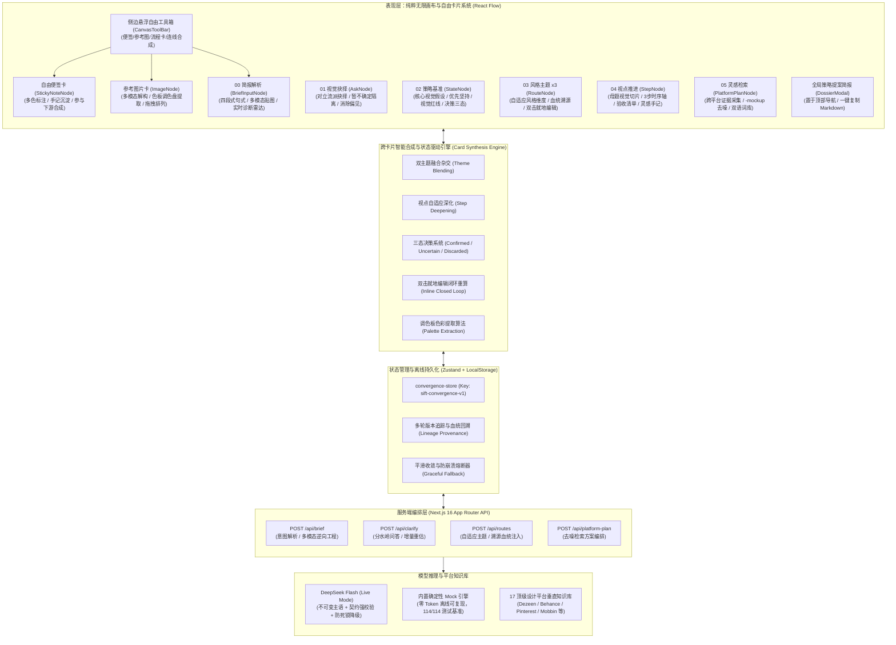
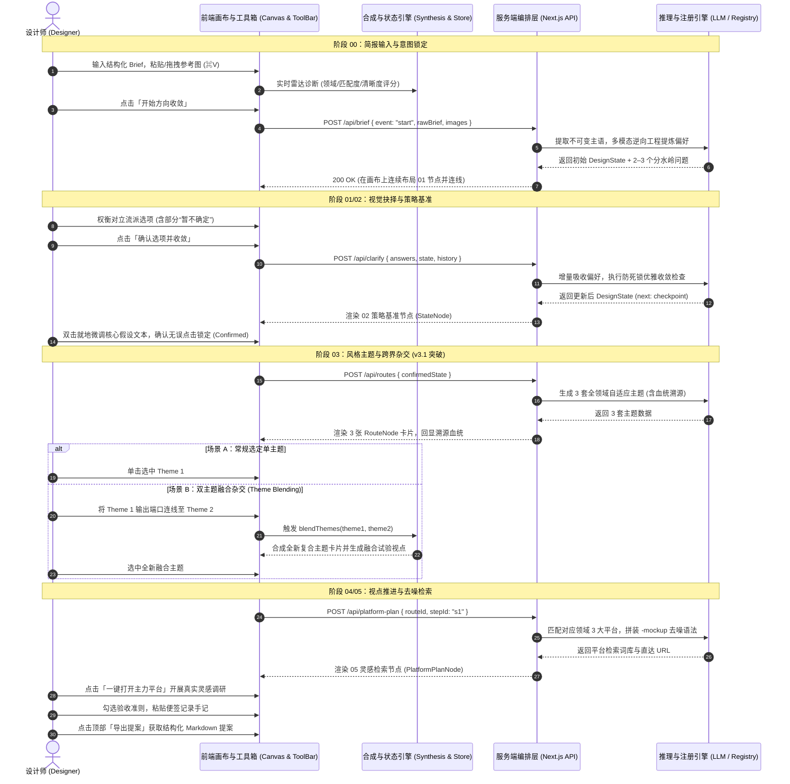
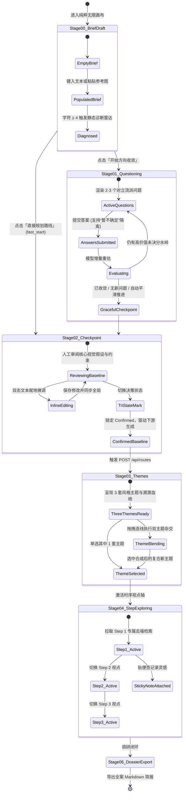
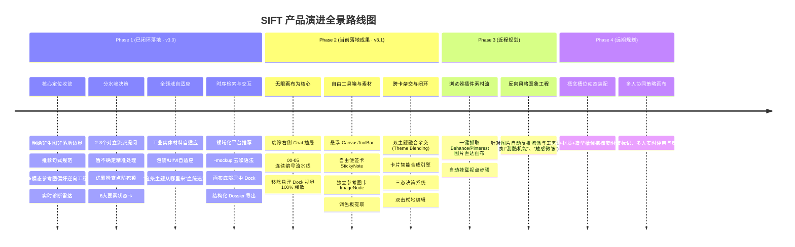

# SIFT：视觉策略与方向收敛智能体
## 产品需求文档 (PRD v3.1) 与完整用户流程规范

**文档版本**：v3.1 (无限画布驱动、自主连接与跨主题杂交合成版)  
**产品代号**：SIFT (Visual Strategy & Direction Convergence Agent)  
**最新更新**：2026-09-23  
**文档状态**：正式发布 / 研发与设计最新基准  
**对应工程**：`veribox-mvp` (Next.js 16 App Router + React Flow + Zustand + DeepSeek Flash / Live / Mock)  
**文档归属**：AI 在设计前期工作流中的重构实践（纯粹无限画布范式）

---

## 目录
1. [执行摘要与问题洞察](#1-执行摘要与问题洞察)
2. [产品定位、核心边界与人机分工](#2-产品定位核心边界与人机分工)
3. [目标用户与典型场景](#3-目标用户与典型场景)
4. [系统全景架构与技术方案 (v3.1)](#4-系统全景架构与技术方案-v31)
5. [完整端到端用户流程 (User Flow v3.1)](#5-完整端到端用户流程-user-flow-v31)
   - 5.1 [全景业务流程图](#51-全景业务流程图)
   - 5.2 [四方人机协同时序泳道图](#52-四方人机协同时序泳道图)
   - 5.3 [核心状态机流转与三态决策机制](#53-核心状态机流转与三态决策机制)
   - 5.4 [无限画布工具卡片自主连接与探索流](#54-无限画布工具卡片自主连接与探索流)
6. [功能模块详细需求规范](#6-功能模块详细需求规范)
   - 6.1 [模块一 (Node 00)：00 简报解析 · 视觉意图输入 (BriefInputNode)](#61-模块一node-0000-简报解析--视觉意图输入-briefinputnode)
   - 6.2 [模块二 (Node 01/02)：01 视觉抉择与 02 策略基准 (AskNode / StateNode)](#62-模块二node-010201-视觉抉择与-02-策略基准-asknode--statenode)
   - 6.3 [模块三 (Node 03)：03 风格主题与血统溯源 (RouteNode)](#63-模块三node-0303-风格主题与血统溯源-routenode)
   - 6.4 [模块四 (Node 04)：04 视点推进与实操验收 (StepNode)](#64-模块四node-0404-视点推进与实操验收-stepnode)
   - 6.5 [模块五 (Node 05)：05 灵感检索与去噪词库 (PlatformPlanNode)](#65-模块五node-0505-灵感检索与去噪词库-platformplannode)
   - 6.6 [模块六：自由创作卡片群与悬浮工具箱 (CanvasToolBar / StickyNote / ImageNode)](#66-模块六自由创作卡片群与悬浮工具箱-canvastoolbar--stickynote--imagenode)
   - 6.7 [模块七：突破性跨卡片智能合成与杂交引擎 (Card Synthesis & Blending Engine)](#67-模块七突破性跨卡片智能合成与杂交引擎-card-synthesis--blending-engine)
   - 6.8 [模块八：三态决策、就地双击编辑与闭环重算](#68-模块八三态决策就地双击编辑与闭环重算)
   - 6.9 [模块九：提案沉淀 (Dossier)：全案结构化导出与视界净化](#69-模块九提案沉淀-dossier全案结构化导出与视界净化)
7. [数据模型与接口契约](#7-数据模型与接口契约)
8. [非功能性需求与系统质量边界](#8-非功能性需求与系统质量边界)
9. [产品演进路线图 (Roadmap)](#9-产品演进路线图-roadmap)

---

## 1. 执行摘要与问题洞察

### 1.1 背景来源与导师评审重塑
本产品的规划与架构设计直接源自一线设计工作流调研及 2026-09-22 导师深度复盘评审：
> **“在设计前期，找图本身并不占优势——互联网上不用花钱就能搜到海量素材。原先很多 AI 都是对话框的形式，做工作时要同时开好几个（GPT、TPS、豆包），来回切换很割裂。采用画布式，对于设计师团队来说是更友好的界面。SIFT 的核心优势是通过画布形式更加适配创意类工作：理清搜索次序，把模糊的需求收敛为清晰、有画面感的设计判断，避免前期漫无目的地试错。”**

### 1.2 传统设计前期流程四大断层
1. **意图与边界模糊**：拿到一段模糊简短的 Brief 或几张零散参考图后，设计师大脑中虽有初步感受，但无法明确项目的最大不确定性是什么，常常混淆核心视觉诉求与物理技术约束。
2. **AI 工具的定位误导（“生图幻觉”）**：市场上大量工具试图用 Midjourney / Stable Diffusion 一键生成效果图，但设计前期不需要、也不能依赖空洞且无法落地的“概念渲染图”。设计师需要的是清晰的**视觉策略、设计主张与检索方向**。
3. **平台与词汇生态屏障（信息噪音）**：
   - 搜图过程缺乏结构化时序：先搜材质、流派、调性，还是先搜布局结构？
   - 商业样机贴图泛滥：在 Behance、Pinterest 等平台检索时，搜出大量千篇一律的贴图样机（Mockup），掩盖了真实材质工艺与排版细节。
4. **决策不收敛与灵感散落**：无目的漫游翻图导致灵感碎片化，收藏夹堆积数以百计零散图片，却难以向团队和客户汇报明确的设计路线、推进依据与血统溯源。

---

## 2. 产品定位、核心边界与人机分工

### 2.1 产品定位
**SIFT 是一款面向专业设计师的视觉策略与方向收敛智能体 (Visual Strategy & Direction Convergence Agent)。**

它的目标是：**当你拿到一段模糊的 Brief 或几张参考图时，在纯粹的无限画布上，通过关键的视觉分水岭提问与卡片自主连接/杂交，快速收敛出清晰、有画面感的设计主题与检索方向，避免前期漫无目的地试错。**

### 2.2 核心边界（坚决不做的范围）
- **坚决不做自动生图 / 渲染交付工具**：SIFT 不输出最终效果图、渲染图、生产施工图或 3D 打印切片。前期策略探索绝不越俎代庖替代落地交付。
- **坚决不做项目管理看板或打样合规仪表盘**：彻底剥离“300g打样、包装模切、模具公差”等执行阶段参数，保持纯粹的前期设计工具心智。
- **坚决取消右侧聊天抽屉（Canvas-as-Core）**：无限画布是唯一的舞台，杜绝割裂的多窗口 Chat 对话，所有 Agent 交互均直接在画布卡片内完成。
- **绝不替设计师做最终美学抉择**：AI 负责发散可能性、建立分水岭对比并理清搜索次序；设计师始终掌握关键判断与最终拍板权。

### 2.3 人机分工与设计哲学
| 角色 | 核心职责 | 输出物 |
| :--- | :--- | :--- |
| **SIFT Agent** | 结构化拆解需求、逆向工程参考图偏好、提炼视觉分水岭问题、推导画面感假设、编排跨平台去噪检索策略、智能杂交双主题 | 结构化提问、Design State、自适应设计主题、时序步骤、去噪搜索方案、复合杂交主题 |
| **设计师 (Human)** | 明确商业意图、权衡分水岭选项、提供主观审美偏好、拍板探索路线、执行双主题融合、双击就地修正 | 选项抉择、路线决策、验收清单确认、灵感手记、跨卡片连接 |

- **准则一：无限画布即核心（Canvas-as-Core）**：界面彻底去噪，将 100% 视界归还给画布，卡片即工具。
- **准则二：全领域自适应（Discipline-Adaptive）**：自动识别产品/实体材质、包装/容器、UI/数字界面、品牌/VI 等不同载体，提炼专属策略。
- **准则三：假设与事实严格隔离**：模型推论打上 `basis: "assumption"`（待确认），用户确认内容打上 `basis: "user"`（事实）。
- **准则四：克制专业的瑞士风格排版**：界面采用中性石灰色板、严谨网格与微交互，剔除所有营销式警示框与浮夸动画。

---

## 3. 目标用户与典型场景

### 3.1 目标用户画像
1. **工业/产品/CMF 设计师**：面对环保材料、新型工艺、实体伴侣器物等前沿需求，需要从模糊概念中理清材质触感、加工方式与形态隐喻。
2. **包装与品牌设计师**：面对“要高端但预算有限”、“要极简但有辨识度”等冲突型 Brief，需要确立视觉层级、材质工艺与包装开箱仪式感。
3. **UI / 数字界面设计师**：需要确立数字工作台或界面的信息架构密度、暗色机能调性或微交互质感。
4. **设计总监 / 独立设计顾问**：需要快速向客户汇报一套具备严密推导逻辑与血统追溯的视觉策略提案（Dossier），并自由杂交多套概念方案。

### 3.2 典型使用场景

| 场景分类 | 典型用户输入示例 | 核心痛点 | SIFT 响应策略 |
| :--- | :--- | :--- | :--- |
| **实体产品与可持续材质** | “我想做一个宠物毛发的可持续设计产品，具有情感设计，加工成可用新材料。” | 概念先锋但缺少工程感知，传统 AI 容易漂移到平面 Logo。 | 锁定工业与 CMF 领域，提问聚焦微纤维机理与天然粘结剂，生成【原生纤维·触感转化】等实体主题，平台直达 Dezeen 材料报道与 Behance CMF。 |
| **约束冲突型包装设计** | “我想做一个冷泡茶包装设计，希望整体克制日常，避免大插画与传统红金罐，探索特种纸微触感。” | 预算有限与高端质感冲突，不知如何在正面排版与特种工艺间取舍。 | 抛出视觉层级分水岭选择，收敛出【纯净特种纸微触感】路线，规划 Pinterest 纸张工艺与小红书实拍质感检索。 |
| **跨界概念杂交探索 (v3.1)** | 将已生成的【原生木质纤维】主题卡片与【现代透明机能】主题卡片进行跨卡连线。 | 想兼顾温润亲和的自然材质与前卫精密的机能科技感，不知如何视觉统合。 | 触发「双主题杂交融合引擎」，智能提取两者的核心母题、表面工艺与空间骨架，合成【复合机能自然物】新主题，生成专属 3 步融合试验。 |

---

## 4. 系统全景架构与技术方案 (v3.1)



---

## 5. 完整端到端用户流程 (User Flow v3.1)

### 5.1 全景业务流程图

```mermaid
flowchart TD
    Start([设计师进入 SIFT 工作台]) --> CanvasInit[呈现纯粹无限画布与工具箱]
    
    subgraph Flow0_Input ["00 简报解析与意图锚定"]
        CanvasInit --> N00[00 BriefInputNode]
        N00 --> InputAct{输入意图}
        InputAct -- "四段式标准句式" --> RunStart[点击「开始方向收敛」]
        InputAct -- "全局粘贴参考图 (⌘V)" --> ExtractPalette[提取调色板与材质肌理]
        ExtractPalette --> RunStart
        InputAct -- "明确构想 / 时间紧迫" --> FastStart[点击「直接规划路线」]
    end

    subgraph Flow1_Ask_State ["01 视觉抉择与 02 策略基准"]
        RunStart --> POSTBrief[POST /api/brief]
        POSTBrief --> N01[渲染 01 AskNode (2-3个分水岭题目)]
        N01 --> UserChoice{设计师抉择}
        UserChoice -- "勾选对立选项 / 输入文本" --> AnsSubmit[POST /api/clarify]
        UserChoice -- "存疑项" --> AnsUncertain[勾选「暂不确定」]
        AnsSubmit & AnsUncertain --> N02[生成 02 StateNode 策略基准]
        N02 --> TriStateCheck{策略核对与三态决策}
        TriStateCheck -- "双击就地修改" --> InlineEditState[修改核心假设 / 约束]
        TriStateCheck -- "确认锁定" --> ConfirmState[标记 Confirmed 并生成风格主题]
        FastStart --> ConfirmState
    end

    subgraph Flow2_Routes_Themes ["03 风格主题探索与跨界杂交 (v3.1)"]
        ConfirmState --> POSTRoutes[POST /api/routes]
        POSTRoutes --> N03[平铺展示 3 套自适应风格主题 (RouteNode)]
        N03 --> RouteBranch{设计师交互}
        RouteBranch -- "单选满意主题" --> PickSingle[高亮选定主题并激活下游]
        RouteBranch -- "跨卡连线 (双主题融合)" --> ConnectBlend[将主题 A 与主题 B 连接]
        ConnectBlend --> SynthEngine[卡片合成引擎执行 blendThemes]
        SynthEngine --> NewBlendedRoute[生成兼具两者的全新跨界主题卡片]
        NewBlendedRoute --> PickSingle
    end

    subgraph Flow3_Steps_Search ["04 视点推进与 05 灵感检索"]
        PickSingle --> N04[展开 04 StepNode (3步时序轴)]
        N04 --> StepSelect{视点流转}
        StepSelect --> POSTPlan[POST /api/platform-plan]
        POSTPlan --> N05[展开 05 PlatformPlanNode]
        N05 --> SearchRun{实操调研}
        SearchRun -- "打开全部主力平台" --> OpenWeb[新标签页拉起去噪检索]
        SearchRun -- "复制关键词" --> CopyWords[一键写入剪贴板]
        N04 --> ChecklistNotes[勾选验收准则 / 记录灵感手记 / 贴便签]
    end

    subgraph Flow4_Dossier ["06 策略提案沉淀与导出"]
        ChecklistNotes --> OpenDossier[点击顶部导航「导出提案」]
        OpenDossier --> ViewDossier[拉起全局 Dossier 简报]
        ViewDossier --> ExportAct[复制 Markdown 或下载 .md 文件]
    end
```

---

### 5.2 四方人机协同时序泳道图



---

### 5.3 核心状态机流转与三态决策机制



---

## 6. 功能模块详细需求规范

### 6.1 模块一 (Node 00)：00 简报解析 · 视觉意图输入 (BriefInputNode)
- **节点标识**：`00 简报解析 (BriefInputNode)`
- **视觉层级与克制表达**：
  - 采用中性微字阶说明：`聚焦前期视觉策略与检索方向收敛 · 非生图交付工具`。
  - 顶部显式标注：`00 简报解析 · 视觉意图输入`。
- **推荐句式规范与一键套用**：
  - 内嵌轻量浅灰推荐条：`推荐结构：我想做一个【品类】，希望【调性】，避免【禁忌】…` 搭配 `[套用模板]` 按钮。
  - 标准四段式：`我想做一个【设计品类】，希望整体呈现【核心视觉调性与受众感受】，避免【明确的视觉禁忌与常见套路】，重点探索【材质工艺、排版结构或细节】。`
- **多模态参考图与全局粘贴 (⌘V)**：
  - 支持拖拽、文件选择与全局剪贴板截图粘贴（⌘V）。
  - 模型接收到图片后，执行色彩、网格负空间、材质肌理的逆向工程提取，并在提问中显式引用参考图中的视觉现象。
- **实时简报诊断雷达**：
  - 字符长度 ≥ 4 字符时触发前端静态解析（延迟 <5ms），展示品类领域标签、匹配度百分比、清晰度评分（0–100），并给出极简优化建议。

---

### 6.2 模块二 (Node 01/02)：01 视觉抉择与 02 策略基准 (AskNode / StateNode)
- **节点标识**：`01 视觉抉择 (AskNode)` 与 `02 策略基准 (StateNode)`
- **批次分水岭提问机制 (01 视觉抉择)**：
  - 每轮提出 2–3 个高对比度问题，按 blocking > material > minor 排序。
  - 题干极精炼（≤35 字），选项 2–3 个（每项 ≤32 字），严格采用「流派/手法：具象取舍」对立格式。
  - 支持每题单选、自定义输入或选择“暂不确定”。
- **“暂不确定”精准处理**：
  - 选“暂不确定”的题目保持未决状态，不强制推导虚假偏好，更不将其他题目的锁定状态误施加于该题。
- **平滑收敛降级机制 (Graceful Checkpoint Fallback)**：
  - 当模型检测到方向已经收敛、或后续轮次中无更多高价值新问题时，系统自动将当前累积的全部偏好持久化并推进至人工检查点，严禁抛出中断性系统异常。
- **02 策略基准核心要素**：
  1. `brief`: 目标、受众、交付媒介。
  2. `constraints`: 约束列表（明确标注 `user` 事实或 `assumption` 待确认假设，附带 `sourceIds` 追溯）。
  3. `direction`: 核心视觉主张 `intent`、坚持偏好 `priorities`、审美雷区 `avoid`、评价准则 `criteria`。
  4. `currentHypothesis`: ≤120 字、具象且富有画面感的当前设计假设。
  5. `validationAction`: 10–20 分钟内设计师可直接在电脑或工位上实操的轻量对照动作。
- **人工检查点确认**：支持双击编辑与三态切换，确认锁定后作为下阶段路线生成的绝对地基。

---

### 6.3 模块三 (Node 03)：03 风格主题与血统溯源 (RouteNode)
- **节点标识**：`03 风格主题 (RouteNode x 3)`
- **全领域自适应设计主题 (Discipline-Adaptive Territories)**：
  - **产品与实体材质类**：自动收敛为材质探索维度（例如：【原生纤维 · 触感转化】、【情感器物 · 陪伴隐喻】），深入微纤维机理、天然粘结剂、粗砺哑光触感与功能载体。
  - **包装与容器类**：收敛为特种纸微触感、容器骨架、风味标尺排版与开箱仪式感。
  - **数字与界面类**：收敛为高密度数据架构、暗色极客机能、非对称环抱式布局。
  - **品牌与 VI 类**：收敛为极简几何轮廓、纯字体微标尺、先锋色彩对撞。
- **“这条主题从哪里来”血统溯源卡片 (Lineage Box)**：
  - 每套主题下方均渲染专属溯源框，清晰呈现：用户原始 Brief 意图锚点、已确认的视觉坚持、明确避开的视觉雷区。
- **推荐标识与单选高亮**：
  - 模型标注 1 条首选推荐路线并给出客观理由；
  - 设计师点击选中其中 1 条路线后高亮并展开下游 04 视点推进卡片，其余路线降权淡化。

---

### 6.4 模块四 (Node 04)：04 视点推进与实操验收 (StepNode)
- **节点标识**：`04 视点推进 (StepNode)`
- **母题切片与连续性回显**：卡片显著回显它所归属的母主题名称与视觉切片定义。
- **递进式 3 步时序轴**：针对选定主题拆解为递进的视觉视点（如 Step 1 材料配比试验 -> Step 2 伴侣器物形态试验 -> Step 3 场景功能共生）。
- **具象设计验收清单 (Checklist)**：针对每个步骤提供 2–3 条客观可评判的视觉验收标准（支持复选勾选，实时计算达成率）。
- **实操灵感手记 (Notes)**：提供即时文本输入区域，允许设计师随手记下调研灵感，手记内容自动持久化并整合进最终提案简报。

---

### 6.5 模块五 (Node 05)：05 灵感检索与去噪词库 (PlatformPlanNode)
- **节点标识**：`05 灵感检索 (PlatformPlanNode)`
- **领域化平台权重自适应**：
  - 实体产品/材质：优先规划 **Dezeen 材料报道**、**Behance 工业设计与 CMF**、**Pinterest 特种材料质感**。
  - 包装方案：优先规划 Behance Packaging、Pinterest Packaging、小红书实拍。
  - 界面方案：优先规划 Dribbble UI、Mobbin、Behance UI/UX。
- **高级去噪负向语法注入**：自动在检索式中注入 `-mockup -template -vector` 等高级负向排除语法，剔除商业样机贴图与空洞矢量素材。
- **中英双语专业设计词库**：输出英文标准术语（如 `recycled hair fiber product design`、`tactile composite CMF`）搭配中文意图说明。
- **检索动作直达**：提供“一键单平台搜索”、“打开全部3个主力平台”与一键复制关键词到剪贴板。

---

### 6.6 模块六：自由创作卡片群与悬浮工具箱 (CanvasToolBar / StickyNote / ImageNode)
- **组件标识**：`CanvasToolBar.tsx`、`StickyNoteNode.tsx`、`ImageNode.tsx`
- **悬浮工具箱 (CanvasToolBar)**：
  - 部署于画布侧边，提供类似 Figma / Miro 的轻量化悬浮工具栏；
  - 工具项包括：选择移动（Select/Move）、新建便签（Sticky Note）、添加参考图（Image Node）、新增流程卡片（00 Brief / 01 Ask / 02 State / 03 Route / 04 Step / 05 Search）；
  - 展开与折叠自如，不占用画布操作区域。
- **自由便签卡 (StickyNoteNode)**：
  - 支持多色彩标记（石灰灰、暖黄、薄荷绿、浅蓝等）；
  - 支持随时键入设计师的随想、设计准则或备忘提示；
  - 便签卡具备标准连线端口，连线汇入下游节点时，便签内容将作为补充约束参与后续模型计算。
- **参考图片卡 (ImageNode)**：
  - 支持本地文件选择、拖拽与外部 URL 引入；
  - **调色板提取（Palette Extraction）**：自动提取图片中的主色与辅助色，生成色彩 Hex 调色盘；
  - 支持设计师为参考图添加视觉标签（如“高光转折”、“微孔触感”），可自由拖拽排列。

---

### 6.7 模块七：突破性跨卡片智能合成与杂交引擎 (Card Synthesis & Blending Engine)
- **模块代码**：`src/lib/card-synthesis.ts` 与 `src/lib/card-synthesis.test.ts`
- **双主题融合杂交 (Theme Blending)**：
  - **核心逻辑**：当设计师在画布上将两个风格主题（Theme A 与 Theme B）进行端口连线交互时，引擎自动触发杂交算法：
    1. 提取两者核心名称、切入点与视觉维度（如 Theme A 的“原生纤维形态”与 Theme B 的“现代高透机能”）；
    2. 生成复合跨界主题标题（如“【复合原生纤维 × 现代透明机能】”）；
    3. 自动生成专属的 3 步融合时序步骤：
       - *Step 1：双主题母题杂交与造型骨架试验*
       - *Step 2：复合材质微触感与表面过渡试验*
       - *Step 3：场景共生与整体系统验证试验*
    4. 计算综合契合度评分与融合优势说明。
- **多维度派生推导支持**：
  - `evolveTheme`：单主题自适应衍生；
  - `deriveThemeFromStrategy`：由策略基准卡片直接推导主题；
  - `deriveStepsFromTheme`：根据主题自适应派生步骤；
  - `derivePlanFromStep`：根据视点步骤推导检索方案；
  - `synthesizeCardFromInputs`：根据多卡片综合输入执行全自动图谱合成。

---

### 6.8 模块八：三态决策、就地双击编辑与闭环重算
- **三态决策系统 (Tri-state Decision Engine)**：
  - 每张卡片均具备明确的三态标识器：
    - **Confirmed (锁定)**：作为核心已确认事实进入下游推导；
    - **Uncertain (存疑)**：保留未决探索空间，不强制下定论；
    - **Discarded (废弃)**：作为明确视觉雷区（Avoided Traps）注入检索与提示词排噪引擎。
  - 摒弃以往复杂的二级抽屉，操作轻量直接。
- **双击就地编辑 (Inline Card Editing)**：
  - 核心卡片上的标题、假设、描述、问题等文本均支持双击进入行内编辑框；
  - 编辑保存后，下游已连线的子卡片自动检测到上游脏数据，并提供“一键级联重算”动作，形成无缝人机协同闭环。

---

### 6.9 模块九：提案沉淀 (Dossier)：全案结构化导出与视界净化
- **组件标识**：`DossierModal.tsx` 与 `export-dossier.ts`
- **视界净化**：
  - 彻底移除原底部悬浮 `CanvasNavDock`，消除对画布卡片的任何物理遮挡；
  - 提案导出入口收纳至顶部全局工作台栏目，点击一键拉起。
- **提案内容结构**：
  1. 简报基础信息（原始 Brief、行业诊断标签、多模态参考图分析）；
  2. 锁定视觉主张（意图、坚持偏好、视觉雷区、评价准则、当前视觉假设、实操验证动作）；
  3. 选定设计主题与血统溯源证明（若为融合主题，回显双亲主题杂交记录）；
  4. 深入探索视点（各步骤目标、验收准则达成率、设计师灵感手记）；
  5. 跨平台去噪检索词库（各平台中英关键词汇总与直达链接）。
- **导出方式**：支持一键复制完整 Markdown 至剪贴板，或下载本地 `.md` 文件。

---

## 7. 数据模型与接口契约

### 7.1 核心数据结构 (TypeScript Interfaces)

```typescript
// 1. 核心判断条目
export interface Judgment {
  text: string;
  basis: "user" | "assumption";
  sourceIds: string[];
}

// 2. 核心方向状态
export interface DesignState {
  revision: number;
  status: "questioning" | "checkpoint" | "confirmed";
  brief: {
    goal: string | null;
    audience: string | null;
    deliverable: string | null;
  };
  constraints: Judgment[];
  direction: {
    intent: Judgment | null;
    priorities: Judgment[];
    avoid: Judgment[];
    criteria: Judgment[];
  };
  currentHypothesis: string | null;
  validationAction: {
    label: string;
    instruction: string;
  } | null;
  uncertainties: {
    id: string;
    topic: string;
    impact: "blocking" | "material" | "minor";
    decisionAffected: string;
    status: "open" | "deferred";
  }[];
  visualKeywords: string[];
}

// 3. 探索主题路线与杂交元数据 (v3.1)
export interface Route {
  id: string;
  title: string;
  themeName?: string;
  focusDimension?: string;
  startingPoint?: string;
  coreProblem?: string;
  purpose?: string;
  pros?: string;
  cons?: string;
  recommendedReason?: string | null;
  alignmentScore?: number;
  tradeoffs?: string;
  recommended?: boolean;
  provenance?: {
    briefAnchor?: string;
    confirmedPriorities?: string[];
    avoidedTraps?: string[];
    parents?: string[]; // 杂交溯源：双亲主题 ID
  };
  steps: RouteStep[];
}

export interface RouteStep {
  id: string;
  title: string;
  question: string;
  purpose: string;
  acceptanceCriteria?: string[];
  done?: boolean;
}

// 4. 自由节点类型系统 (v3.1)
export type ToolType =
  | "brief"
  | "watershed"
  | "ask"
  | "anchor"
  | "state"
  | "route"
  | "step"
  | "platformPlan"
  | "note"
  | "image";

// 5. 便签与参考图数据模型
export interface StickyNoteData {
  id: string;
  text: string;
  color: "slate" | "amber" | "emerald" | "sky" | "rose";
  createdAt: number;
}

export interface ImageData {
  id: string;
  url: string;
  caption?: string;
  palette?: string[]; // 提取出的十六进制色板 ['#1E293B', '#E2E8F0', ...]
  tags?: string[];
}
```

### 7.2 API 服务契约规范

| 接口路由 | 方法 | 对应流程 | 输入核心参数 | 输出核心模型 | 核心防错与设计保证 |
| :--- | :--- | :--- | :--- | :--- | :--- | :--- |
| `/api/brief` | `POST` | 阶段 00 初始化 | `rawBrief`, `images`, `sessionId`, `event: "start" \| "fast_start"` | `TurnResult (state, next)` | `fast_start` 保证返回 Checkpoint 并标注假设；支持多模态参考图传递 |
| `/api/clarify` | `POST` | 阶段 01 问答推进 | `sessionId`, `event: "answer"`, `answers: Answer[]`, `state`, `history` | `TurnResult (state, next)` | 精准题号匹配；防死锁与 ID 碰撞隔离；方向就绪时优雅推进检查点 |
| `/api/routes` | `POST` | 阶段 03 主题推导 | `confirmedState`, `history`, `rawBrief`, `refreshIndex` | `{ routes: Route[3] }` | 全领域自适应（工业材料/包装/UI/VI）；注入血统追溯信息；标注 1 项推荐 |
| `/api/platform-plan`| `POST`| 阶段 05 检索规划 | `routeId`, `stepId`, `selectedRoute`, `focusDimension`, `state` | `PlatformPlan` | 动态匹配适合该领域的 3 大平台；自动注入 `-mockup` 去噪语法与双语词库 |
| `/api/status` | `GET` | 系统探活 | 无 | `{ status: "ok", mode: "live" \| "mock" }` | 监控 LLM API 连通性与运行模式 |

---

## 8. 非功能性需求与系统质量边界

1. **防死锁与弹性容错架构 (Zero-Deadlock Fault Tolerance)**：
   - 杜绝因大模型重复已有判断或泛型 ID 碰撞向用户抛出 502 致命异常。在问答轮次中遇到决策闭环时，系统自动优雅降级为进入人工检查点。
2. **迟到网络回调与时序防护 (Race Condition Guard)**：
   - 每次网络交互携带 `(sessionId, requestId, revision)` 标识锁，当用户切换主题或重新发起任务时，自动丢弃旧异步回调，杜绝数据脏写与画布节点跳动。
3. **数据隐私与全量本地持久化**：
   - 画布全量数据本地持久化于浏览器 `LocalStorage`（Key: `sift-convergence-v1`），支持跨页面刷新无损恢复画布节点位置、选择项与手记。
4. **性能预算与交互响应**：
   - 前端静态诊断与卡片杂交计算延迟 < 10ms；
   - 调色板颜色提取算法（Palette Extraction）在浏览器端 15ms 内完成；
   - 服务端大模型复杂推导超时上限严格控制在 45s 以内，具备轻度残缺 JSON 自动修复补全能力。
5. **专业克制的设计语言与无障碍标准**：
   - 界面严格遵循瑞士极简中性石灰色板（`stone` / `cream` / `accent`），不滥用饱和色背景与营销弹窗；
   - 严格遵循 WCAG 2.1 AA 标准，交互元素完全支持键盘 Tab 导航与快捷键操作（如 `⌘↵` 提交简报，`⌘V` 贴图），支持系统 `prefers-reduced-motion` 动效减弱。
6. **工程质量底线**：
   - 代码库内置自动化测试套件共计 **114 个用例**（涵盖卡片合成、多主题杂交、多模态处理与全流程收敛），必须保持 **100% 绿灯全通**。

---

## 9. 产品演进路线图 (Roadmap)



### 9.1 Phase 3：视觉素材收藏挂接与以图反推词法（近程）
- **素材回填挂接 (Visual Asset Bookmarking)**：在 Behance、Dezeen 或 Pinterest 查阅案例时，支持通过轻量浏览器插件，将灵感图直接飞入画布并挂接到对应步骤卡片下方。
- **图像风格逆向反推 (Style Reverse Engineering)**：AI 自动识别收藏图片的流派特征、色彩基调与表面工艺，提炼为可复用的关键词资产。

### 9.2 Phase 4：槽位式概念拼装与多人协同（远期）
- **语法化槽位拼装（Slot-based Composition）**：将设计维度抽象为「核心母题 + 材质工艺 + 空间骨架 + 视觉调性」槽位，允许设计师拖拽素材模块快速组合多套概念雏形。
- **多人协同画布 (Multiplayer Strategy Canvas)**：支持设计团队多人同时在线讨论分歧、标记决策依据，直接向业务方进行动态策略推演汇报。

---

*文档编写完成 · 经全量工程代码核验与测试用例验证 (114/114 Pass) · 作为 SIFT 智能体全生命周期的最新产品设计与技术基准*
