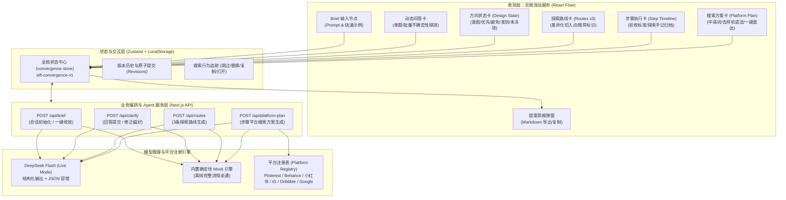
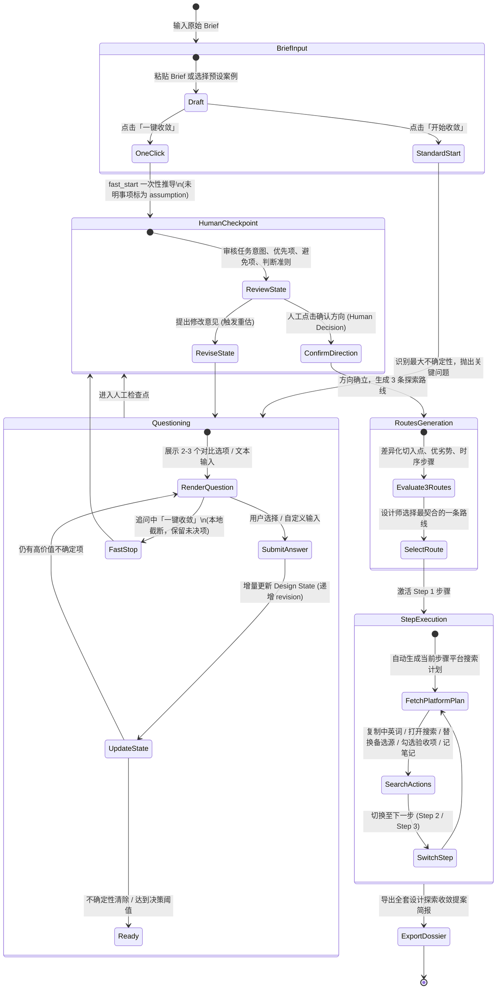
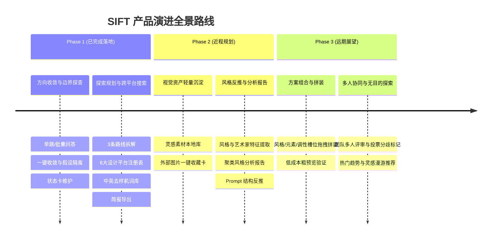

# SIFT 产品需求文档 (PRD v2.0)

**产品全称**：SIFT - 设计方向收敛与视觉探索 Agent (Design Convergence & Exploration Agent)  
**当前版本**：v2.0 (全闭环生产版)  
**文档状态**：正式发布 / 对应当前工程实现  
**项目仓库**：`veribox-mvp`  
**核心框架**：Next.js 15 (App Router) + React Flow (@xyflow/react) + Zustand + DeepSeek Flash LLM / Mock Engine  

---

## 1. 执行摘要与产品背景

### 1.1 背景与用户洞察
在设计前期，设计师拿到模糊或存在约束冲突的 Brief 时，卡点往往**不是「找不到图」**（互联网海量图库和 AI 生图工具已经极大泛滥），而是：
1. **任务理解发散**：不知道项目的核心意图、边界与最大不确定性是什么。
2. **搜索时序混乱**：不知道先搜什么、后搜什么（先风格、调性还是竞品？）。
3. **平台与词汇断层**：不同设计平台（Pinterest、Behance、小红书等）语言生态差异大，中英文转换成本高，普通关键词难以搜出高质量参考（充斥样机贴图噪音）。
4. **决策不收敛**：无目的翻图导致信息过载，耗费数小时却难以沉淀清晰可执行的设计方向。

### 1.2 产品核心主张
**SIFT 的切口是「文字理解与搜索编排」**：
> **Agent 负责组织可能性与降低认知负载，设计师负责关键判断与选择。**
> 把模糊任务变成「收敛的方向状态 + 探索路线 + 时序步骤 + 平台化中英关键词」，让设计师带着清晰明确的目的去外部平台调研，并形成完整的设计提案简报。

---

## 2. 系统全景架构图 (System Architecture)

> *响应设计指导意见：以精确的图表形式，显性化呈现端到端系统架构与数据分层。*



---

## 3. 核心决策状态机与人机协作流转

> *体现导师推崇的关键决策迭代机制：明确人在哪抉择、AI在哪赋能。*



---

## 4. 功能模块详细需求规范

### 4.1 阶段一：设计方向收敛 (Convergence Phase)

#### 4.1.1 模糊 Brief 结构化与初始化
* **输入格式**：支持非结构化自然语言输入（支持中英文，字数建议 20–2000 字）。
* **内置预设案例**：提供冷泡茶、护肤品、SaaS 协同、社区咖啡馆等 6 大典型行业场景。
* **双模式启动**：
  1. **标准启动 (`start`)**：模型提取任务意图、约束条件，并定位最大不确定性生成单题提问。
  2. **一键快速收敛 (`fast_start`)**：单次模型调用，跳过中间提问环节，模型尽最大合理性推导方向，未明事项全部标注为待确认假设（`basis: "assumption"`），直接送入 Human Checkpoint。

#### 4.1.2 动态问答与不确定性探测
* **单题高价值原则**：每轮仅提 1 个核心问题，字数限制 ≤ 40 字；提供 2–3 个有本质差异的选项，支持自定义文本回答。
* **优先级次序**：优先处理约束冲突（如“低成本 vs 奢华工艺”），再探测表达重点，最后澄清受众感知。
* **抗死循环与暂缓机制**：若用户选择“暂不确定”，相同主题最多换一个对照场景重新问一次；若仍不确定，该主题标记为 `deferred`（暂缓），绝不编造用户偏好。
* **追问中途收敛**：在提问中途，用户可随时点击「以此方向继续」，系统执行纯本地截断，不消耗模型调用，直接将当前未决项封存并送入检查点。

#### 4.1.3 设计状态卡 (`DesignState`) 动态呈现
* 包含 6 核心板块：
  1. **Brief 结构化基准**：目标 (Goal)、受众 (Audience)、交付物 (Deliverable)。
  2. **硬性约束 (Constraints)**：明确的技术、时间、预算边界。
  3. **核心设计意图 (Intent)**：一句话定调设计核心灵魂。
  4. **优先坚持 (Priorities)**：设计方案应优先保障的要素。
  5. **坚决避免 (Avoid)**：禁止出现的风格雷区或负向特征。
  6. **判断标准 (Criteria)**：衡量方案成功与否的量化/质化标准。
  7. **未决判断项 (Uncertainties)**：标记待验证或暂缓的事项。
* **严格溯源标注**：每个判断属性带 `basis: "user" | "assumption"`，用户给出的决策与模型假设严格区分展示。

#### 4.1.4 人工检查点 (Human Checkpoint)
* **核心防线**：未经设计师人工确认，系统严禁自动推进至方案生成。
* **操作集合**：
  - **确认方向**：冻结当前方向状态卡，触发探索路线生成。
  - **补充修正**：输入自然语言补充要求，系统增量更新状态并重新校验。

---

### 4.2 阶段二：视觉探索路线与平台搜索编排 (Exploration & Search Phase)

#### 4.2.1 3 套差异化探索路线 (Exploration Routes)
* **生成规则**：基于确认的 `DesignState` 生成正好 3 套具有明显方法论差异的路线：
  - 严禁空泛无意义的纯风格词命名（如“简约风”、“高级感”已被 Schema 阻断）；
  - 必须具备互不相同的切入起点（`startingPoint`）；
  - 最多仅能标记 1 条「推荐路线」，并提供明确推荐理由；
  - 每条路线包含：核心突破问题、优势、潜在风险、工艺可行性（高/中/挑战）及 3–5 个时序推进步骤。
* **画布交互**：以独立路线卡平铺在方向卡右侧，用户点击选择一套后，未选路线降权收起，选定路线展开步骤轴。

#### 4.2.2 时序化步骤轴与阶段验收 (Step Timeline)
* **步骤内容**：每步包含核心调研问题、探索目的、交付物清单（Deliverables）及阶段验收准则（Acceptance Criteria）。
* **交互与归档**：
  - 支持交互式勾选验收准则（如 `[x] 完成3组版式对比`）；
  - 支持步骤手记（Notes）录入，方便沉淀设计师在原网站调研时的灵感手记。

#### 4.2.3 多平台搜索方案与中英关键词资产 (Platform Search Plan)
* **动态绑定**：步骤切换时，Agent 针对该步骤的任务特点动态生成专属的搜索方案。
* **平台注册表机制**：
  | 平台 | 角色定位 (Role Tag) | 核心调研场景 | URL 模板与语法 |
  | :--- | :--- | :--- | :--- |
  | **Pinterest** | 视觉扩散 | 氛围情绪板、色彩材质、跨品类灵感 | 预填 query 自动直达 |
  | **Behance** | 完整项目验证 | 成套落地案、设计推演过程、系统工艺 | 预填 query 自动直达 |
  | **小红书** | 中文语境与真实反馈 | 本土真实消费者晒单、流行卖点与吐槽 | 预填 keyword 自动直达 |
  | **Instagram** | 场景和趋势参考 | 海外先锋品牌切片、社媒即时动态 | 自动去除空格生成 Tag 直达 |
  | **Dribbble** | 数字产品与界面细节 | UI组件、排版微交互、高保真图形小样 | 预填 query 自动直达 |
  | **Google** | 品牌与行业深度验证 | 官方品牌规范、权威评测与跨界标杆 | 预填 query 自动直达 |
* **关键词专业资产**：
  - **中英双语对照**：英文用于海外设计站点，中文用于本土平台，附带中文精准释义；
  - **意图标签分类**：标明 `moodboard` (意向情绪板)、`detail` (细节工艺)、`consumer` (用户语境)、`benchmark` (竞品标杆)；
  - **高级去噪音语法**：内置 `advancedQuery`（如针对 Behance 自动附加 `-mockup` 过滤无效样机贴图模板）。
* **操作流**：
  - **一键新窗口打开**：直接拉起预填充关键词的搜索页面；
  - **批量打开 3 平台**：一键并行打开前 3 个主力平台，大幅提效；
  - **剪贴板复制**：一键复制带微交互反馈，方便设计师粘贴至本地设计软件；
  - **跳过与替换**：不适用的平台可点击跳过，或从备选来源（Alternative Sources）中一键替换。

---

### 4.3 成果归档与提案简报导出 (Dossier Export)

* **一键导出 Markdown 简报**：整合从模糊任务到落地搜索的完整链路资产。
* **简报规范结构**：
  1. `00 原始设计任务 (Brief)`：原始任务文本与目标受众定义；
  2. `01 方向收敛与设计边界 (Convergence)`：核心意图、假设、约束、优先/避免项及准则；
  3. `02 选定探索路线 (Chosen Route)`：切入点、周期、可行性与决策理由；
  4. `03 探索步骤推进与验收清单 (Steps & Execution)`：步骤目标、交付物、验收勾选率、手记归档及对应平台的关键词组合。
* **交互体验**：提供居中模态弹窗，支持全选一键复制至剪贴板，或下载为 `.md` 文件。

---

## 5. 核心数据模型契约 (Data Contracts)

### 5.1 方向收敛状态模型 (`DesignState`)

```typescript
export interface Judgment {
  text: string;
  basis: "user" | "assumption";
  sourceIds: string[]; // 溯源至 brief 或具体的 requestId
}

export interface Uncertainty {
  id: string;
  topic: string;
  impact: "blocking" | "material" | "minor";
  decisionAffected: string;
  status: "open" | "deferred";
}

export interface DesignState {
  revision: number;
  status: "questioning" | "checkpoint" | "confirmed";
  brief: {
    goal: string | null;
    audience: string | null;
    deliverable: string | null;
  };
  constraints: Judgment[];
  direction: {
    intent: Judgment | null;
    priorities: Judgment[];
    avoid: Judgment[];
    criteria: Judgment[];
  };
  currentHypothesis: string | null;
  uncertainties: Uncertainty[];
}
```

### 5.2 探索路线与平台方案模型 (`Route` & `PlatformPlan`)

```typescript
export interface RouteStep {
  id: string;
  title: string;
  question: string;
  purpose: string;
  deliverables?: string[];
  acceptanceCriteria?: string[];
}

export interface Route {
  id: string;
  title: string; // 必须为探索方法，禁止单一空泛风格词
  startingPoint: string;
  coreProblem: string;
  purpose: string;
  pros: string;
  cons: string;
  recommendedReason: string | null; // 至多一条为非 null
  feasibility?: "high" | "medium" | "challenging";
  timeframe?: string;
  steps: RouteStep[]; // 3-5 步
}

export interface PlatformKeyword {
  keyword: string;
  meaning: string;
  language: "zh" | "en";
  searchType?: "moodboard" | "detail" | "consumer" | "benchmark";
  advancedQuery?: string;
}

export interface PlatformSource {
  id: string;
  platform: string;
  roleTag: string;
  reason: string;
  keywords: PlatformKeyword[];
  searchUrl: string;
}

export interface PlatformPlan {
  id: string;
  routeId: string;
  stepId: string;
  primarySources: PlatformSource[];    // 正好 3 个主来源，角色不重复
  alternativeSources: PlatformSource[];// 2-4 个备选来源
}
```

---

## 6. 非功能性需求与技术质量边界

1. **双轨架构设计 (Live / Mock Dual-Engine)**：
   - **Live 模式**：接入 DeepSeek-Flash，配置 `LLM_REASONING_EFFORT=medium`，严格结构化输出与长思考标签（Thinking Process）解析兼容；
   - **Mock 模式**：零 API Key 依赖，内置完整行业案例字典，保证任何网络或无 Key 环境下的全流程演示闭环。
2. **服务端容错与超时预算 (Timeouts & Fallback)**：
   - 单次 API 调用严格控制在服务端 45s、客户端 50s 超时预算内；
   - 具备轻微残缺 JSON 自动修复能力，杜绝向前端返回“半份状态”。
3. **状态幂等与迟到响应拦截 (Concurrency Protection)**：
   - 客户端携带 `(sessionId, requestId, baseRevision)` 三元组；
   - 用户撤销、重新输入或发起新会话时，自动丢弃旧网络异步回调，杜绝时序紊乱与脏写。
4. **纯本地持久化与数据隔离 (Storage Integrity)**：
   - Zustand 数据自动同步至 LocalStorage 键 `sift-convergence-v1`；
   - 会话恢复支持草稿保留、未提交答案防丢失与旧数据向下兼容。

---

## 7. 产品演进路线图 (Roadmap)

> *紧密响应《AI在设计工作中的应用探讨》专家研讨纪要中的长期构想，坚持「先做小跑通，再嫁接做大」的原则。*



### 7.1 Phase 2：素材沉淀与以图反推提示词（近程）
- **灵感收藏挂接**：在各平台搜索时，支持通过扩展或直接粘贴图片 URL，将心仪图片回填至 SIFT 画布。
- **图像反推分析 (Reverse Prompting)**：AI 自动识别收藏图片风格流派（如“甜酷风”、“瑞士现代排版”）、提炼 Prompt 结构，并针对百张级收藏生成聚合灵感报告。

### 7.2 Phase 3：槽位式方案拼装与团队协同（远期）
- **语法化槽位造句（Slot-based Composition）**：将主谓宾语法映射为「风格 + 核心元素 + 视觉调性」，允许设计师将素材卡片拖拽进槽位组装概念雏形。
- **多人协作空间**：支持多位设计师在同一画布上协同筛选方案、标记分歧，并与跨角色成员对齐方向。
