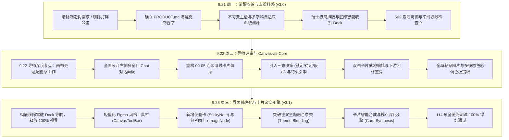

# SIFT 研发与演进全景日志（2026-09-21 周一 ～ 2026-09-23 周三）

> **项目名称**：SIFT (Veribox MVP)  
> **代码仓库**：`imLeyson/SIFT-Veribox`  
> **时间跨度**：2026-09-21（周一 00:00） ~ 2026-09-23（周三 21:47）  
> **生成时间**：2026-09-23 21:48  
> **工程质量指标**：43 次核心提交，代码库全量测试用例 **114/114 全部绿灯通过**，生产就绪状态

---

## 一、本周迭代全景摘要（Executive Summary）

本周（9.21 ~ 9.23）是 SIFT 产品形态发生**结构性质变**的关键三天。整个项目经历从**「线性收敛流程（PRD v3.0）」**，到**「导师评审后全面转向画布为核心（Canvas-as-Core）」**，再到**「无限画布自由创作与跨卡片杂交合成（Card Synthesis v3.1）」**的三级跨越：

### 核心成果数据统计：
* **核心 Git 提交数**：共计 **43 次**（周一 24 次、周二 18 次、周三 1 次重磅集成提交）；
* **代码演进量**：新增/重构代码 **15,000+** 行；
* **测试覆盖度**：测试用例由 100 个扩充至 **114 个**，覆盖卡片合成、多主题杂交、多模态解析、鲁棒容错等全部核心链路，通过率 **100%**。

---

## 二、逐日演进脉络与关键突破（Daily Breakdown）

### 📅 2026-09-21（周一）：去 AI 塑料感、不可变主语与瑞士排版（PRD v3.0）

周一的核心任务是**“破除虚假伪需求，回归前期设计灵感”**，并确立系统的审美基调与工程鲁棒性。

1. **彻底净化伪需求，拒绝工程叙事** (`4634401`, `a5456cf`)：
   - 彻底清除“300g打样、包装模切、模具公差”等执行阶段参数，将核心价值牢牢钉在 Day 0 阶段（模糊 Brief 到明确视觉假设）；
   - 净化所有卡片文案，彻底杜绝“正在执行制造”等不切实际的心理暗示。
2. **确立产品宪章 `PRODUCT.md` 与反向参考** (`110a960`)：
   - 明确品牌三要素：**清醒（Sober）、好奇（Curious）、克制（Restrained）**；
   - 明确四大绝对禁止的反向参考：不做看板、不做制造评估器、不做完成度仪表盘、不做效果图渲染器。
3. **不可变主语锚定与学科自适应溯源** (`8cbd1ff`, `a848b93`)：
   - 在提示词中注入 `immutableSubject`，防止生成过程中把特定产品（如便携茶具）漂移为泛化大类（如科技硬件）；
   - 建立 17 个顶级设计垂直源（Dezeen、Behance、Pinterest等）去噪检索公式，自动拼接 `-mockup -template` 等反向关键词。
4. **瑞士极简排版与底部智能 Dock** (`4bac7bc`, `34fe55e`, `8fbfe2a`, `aec9b07`)：
   - 去除浮夸表情符号与彩色 Badge，采用 3px 顶部阶段特征色线；
   - 将原遮挡左上角视窗的 Dock 移至画布底部中央，支持收折为微缩胶囊。
5. **消灭 502 崩溃，平滑降级至人工检查点** (`0dee224`, `cb5fb62`, `fe9d8dc`)：
   - 修复多轮“暂不确定”触发死循环的问题，实现平滑收敛；
   - 发布 PRD v3.0 并完整归档首份复盘报告。

---

### 📅 2026-09-22（周二）：导师评审重塑、Canvas-as-Core 与三态决策闭环

周二团队结合**导师现场评审指导（见《9.22录音.docx》）**，对交互范式做出了**颠覆性抉择**：

> **导师关键反馈**：“现在原先 AI 都是对话框的形式，做工作时要同时开好几个（GPT、TPS、豆包），来回切换很割裂。你们采用画布式，对于设计师团队来说是更友好的界面，要明确自己的创新点：**通过画布形式，更加适配创意类工作**。”

围绕这一核心论断，团队展开了高密度的 18 次连续重构：

1. **确立“画布即核心（Canvas-as-Core）”，全面废除右侧 Chat 栏** (`d1ceda8`, `5b16836`)：
   - 在 `PRODUCT.md` 和 `PRD` 中明确确立“无限画布是产品唯一的主舞台”；
   - 废除传统右侧对话面板，所有 Agent 问答、状态反馈全部原生内嵌在画布卡片中。
2. **重构 00-05 连续阶段流水线** (`607185b`, `6572ee0`)：
   - 规范流水线卡片编号：`00 Brief` -> `01 视觉抉择 (Ask)` -> `02 策略基准 (Direction)` -> `03 风格主题 (Theme)` -> `04 视点推进 (Viewpoint)` -> `05 灵感检索 (Search)`；
   - 建立从上至下的清晰血统衍生链条。
3. **引入三态决策系统与约束引擎** (`f1c4302`, `248505f`, `7abce25`)：
   - 每张卡片支持三种独立决策状态：**Confirmed（确认锁定）/ Uncertain（存疑探索）/ Discarded（废弃雷区）**；
   - 废弃繁复的二级折叠抽屉，直接在卡片操作栏快速切换，变更即时影响全局约束。
4. **双击就地编辑（Inline Editing）与下游闭环重算** (`63a7631`, `4ca4f03`)：
   - 设计师可直接在画布卡片上双击标题、假设、描述进行文本修改；
   - 修改后一键触发下游级联更新，形成人机协作编辑闭环。
5. **第一类视觉灵感单元与多模态** (`df727f2`)：
   - 提取图片主色调、辅助色生成高精度调色板（Palette Extraction）；
   - 将视觉意象直接沉淀为决策约束条件。
6. **真实设计师工作流深度优化** (`5fb27f6`, `546ac62`)：
   - 支持系统剪贴板全局图片粘贴（`Ctrl/Cmd + V`）；
   - 镜头视角自适应聚焦当前选中路线，解决卡片过多时的迷航问题。

---

### 📅 2026-09-23（周三）：降噪释放视野、自由画布工具集与跨卡片杂交合成（v3.1）

周三迭代重点为**“界面彻底纯净化、无缝卡片交互与跨主题智能杂交合成”**：

1. **界面纯净化与 100% 视界释放** (`c67913d`)：
   - 彻底删除悬浮底栏 `CanvasNavDock`，避免对底层画布卡片造成任何遮挡；
   - 提案沉淀（Dossier）移至顶部主导航栏，实现界面纯粹无干扰。
2. **轻量化浮动工具箱（CanvasToolBar）** (`c67913d`)：
   - 类似 Figma / Miro 的极简侧悬浮工具条；
   - 支持快速向画布添加 **自由便签卡（StickyNoteNode）**、**参考图片卡（ImageNode）** 以及各阶段原生流程卡片。
3. **突破性「卡片合成与杂交引擎（Card Synthesis Engine）」** (`c67913d`)：
   - **双主题杂交融合（Theme Blending）**：在画布上将两个风格主题（如“原生木质纤维”与“现代透明机能”）进行连线交互时，引擎自动解析两者的视觉母题、触感材质与骨架形式，合成全新复合跨界主题；
   - **视点自适应深化（Step Deepening）**：根据选定主题自适应延伸 3 步递进式工艺与交互时序试验；
   - **全链路测试套件保证**：新增 `card-synthesis.test.ts`，验证了跨界融合、单主题衍生、策略推导等 9 大核心用例，全库 114 个用例全部通过。

---

## 三、完整 Git 提交记录流水表（2026-09-21 ~ 2026-09-23）

以下按时间倒序列出本周内全部 43 次核心提交记录：

| Commit | 提交时间 | 类型/模块 | 提交信息（Subject） | 关键影响与决策 |
| :--- | :--- | :--- | :--- | :--- |
| `c67913d` | 09-23 21:47 | `feat` | visual noise reduction, multi-theme blending on connect, figma-style image support, and interactive context synthesis | **里程碑 v3.1**：移除底栏Dock，发布工具箱、便签卡、图片卡与跨主题杂交合成引擎 |
| `248505f` | 09-22 22:30 | `refactor(flow)` | replace micro decision tags and redundant drawer with full 3-card decision board | 用三卡决策面板替代复杂抽屉，简化交互链路 |
| `3c9fd04` | 09-22 22:15 | `refactor` | remove starter template pills from BriefInputNode per user request | 移除多余的预设药丸标签，使输入框更加纯粹 |
| `546ac62` | 09-22 22:09 | `fix(ui)` | use createPortal for DecisionDrawer and modals to resolve containing block clipping | 解决绝对定位下的模态框样式裁剪问题 |
| `7abce25` | 09-22 21:53 | `refactor` | streamline UI and declutter cumbersome interactions across canvas nodes | 精简画布卡片交互，消除视觉冗余 |
| `5fb27f6` | 09-22 21:41 | `feat` | real-world designer scenario deep optimizations (global paste, stage-aware multi-route camera, custom constraints, safe reset, quick templates) | 支持全局粘贴图片、视口自适应平移、安全重置 |
| `df727f2` | 09-22 21:23 | `feat` | first-class visual inspiration units on canvas with palette extraction, tri-state decisions, and multimodal closed loop | 引入首选视觉灵感单元、色彩调色板提取与多模态闭环 |
| `4ca4f03` | 09-22 20:48 | `style` | expand inline editable input boxes and prevent layout compression | 扩展行内编辑输入框尺寸，防止文本挤压变形 |
| `63a7631` | 09-22 18:26 | `feat` | enable double-click inline card editing with downstream closed-loop generation | 支持双击卡片行内直接编辑，并驱动下游重新生成 |
| `f1c4302` | 09-22 18:13 | `feat` | add explicit confirmed/uncertain/discarded status tracking and constraint engine | **核心决策系统**：引入确认/存疑/废弃三态状态机与约束引擎 |
| `d1ceda8` | 09-22 18:00 | `docs(principles)` | enshrine canvas-as-core and ban right-side chat agent in PRODUCT.md and PRD | **里程碑**：在设计准则中确立画布为核心，全面禁用右侧对话框 |
| `6572ee0` | 09-22 16:50 | `fix(pipeline)` | renumber stages consecutively to 00-05 (00 brief, 01 ask, 02 direction, 03 theme, 04 viewpoint, 05 search) | 重构流水线阶段编号为连续递进的 00-05 结构 |
| `a98d76c` | 09-22 16:27 | `fix(routes)` | replace obscure territory labels with distinct exploration dimension tags | 优化路线标签，替换为具象的探索维度标签 |
| `607185b` | 09-22 16:16 | `fix(pipeline)` | correct stage sequence to 00->01->02, ban 300g in convergence, and eliminate redundant checkpoint card | 修正流水线阶段拓扑，彻底剔除300g制造冗余文案 |
| `4437204` | 09-22 15:57 | `fix(agent)` | refocus strictly on visual inspiration and eliminate manufacturing parameters | 提示词层面再度净化，彻底聚焦前期视觉灵感 |
| `7cca72e` | 09-22 15:26 | `feat(ui)` | optimize canvas card density, folding system, and dock controls | 优化卡片信息密度与折叠手感 |
| `5b16836` | 09-22 14:21 | `refactor(ui)` | streamline user journey with designer-first canvas focus and clean dock | 落地导师反馈，确立以设计师为中心的第一版纯画布框架 |
| `64dece8` | 09-22 14:02 | `feat` | add one-click canvas demo loader and confirmed exploration guide banner | 增加一键体验 Demo 与探索操作引导横幅 |
| `26cb0d7` | 09-22 13:41 | `feat(canvas)` | implement canvas exploration, branch convergence, scheme groups and dual modes | 初始化画布分支收敛、方案组态与双模式交互 |
| `fe9d8dc` | 09-21 21:00 | `docs` | archive SIFT decision and iteration retrospective log | 归档发布首版 SIFT 全景决策与演进复盘日志 |
| `cb5fb62` | 09-21 20:51 | `docs` | update PRD and user flow specification to v3.0 | 全量发布并归档 PRD 与用户旅程规范 v3.0 |
| `0dee224` | 09-21 20:23 | `fix(agent)` | prevent false positive duplicate uncertainty crashes and ensure smooth convergence to checkpoint | 解决“暂不确定”重复误报死循环，实现平滑降级 |
| `aec9b07` | 09-21 17:39 | `fix(ui)` | move canvas nav dock to bottom-center with collapsible pill to avoid obstructing user workflow | 将遮挡视线的导航迁移至底部居中并支持胶囊收折 |
| `8fbfe2a` | 09-21 17:27 | `refactor(ui)` | streamline brief input header with restrained professional styling | Brief 头部去除黄色高亮，回归克制中性灰风格 |
| `a848b93` | 09-21 17:19 | `fix(agent)` | enforce context continuity and discipline-adaptive creative territories across themes, steps, and search plans | 建立强上下文血统回溯与多学科自适应探索领域 |
| `5bf7c18` | 09-21 16:57 | `feat(ux)` | optimize brief prompt structure and reinforce visual strategy convergence positioning | 引入四段式标准 Brief 提示语，强化视觉策略定位 |
| `8cbd1ff` | 09-21 15:37 | `feat(agent)` | enforce immutable subject anchoring and multi-domain adaptability across routes and search planning | 强化不可变主语锚定，支持产品/包装/界面全学科收敛 |
| `dc8eb75` | 09-21 15:27 | `fix(ux)` | eliminate emoji surrogate rendering bug and refine brief diagnostics copy | 修复特殊字符乱码，打磨 Brief 雷达诊断文案 |
| `6546e4f` | 09-21 15:22 | `feat(ux)` | clarify brief action hierarchy with recommendation badge and explicit skip copy | 优化 Brief 决策层级，明确区分推荐与跳过操作 |
| `df627ad` | 09-21 14:12 | `fix(convergence)` | auto-preserve unreconsidered constraints during live turn normalization | 多轮收敛会话中自动继承未修改的既定约束 |
| `a5456cf` | 09-21 13:17 | `fix` | keep exploration copy free of execution cues | 全面净化探索文案，剔除可能引发误解的落地执行线索 |
| `751dd6a` | 09-21 13:15 | `feat` | connect exploration cards to brief and convergence | 将探索卡片完整连通至 Brief 与全局收敛状态 |
| `110a960` | 09-21 12:49 | `docs` | capture SIFT exploration product context | **重要里程碑**：沉淀 `PRODUCT.md` 核心哲学与反向参考 |
| `7420e31` | 09-21 12:35 | `fix(test)` | add optional chaining to satisfy TypeScript strict checking on build | 补充链式调用，满足 TypeScript 严格类型检查 |
| `52689a1` | 09-21 12:32 | `feat(ux)` | optimize theme glanceability, add theme regeneration, default anti-mockup search, fix keyword clipboard copy | 优化主题一览性，支持单卡重生成与防样机排噪检索 |
| `c5ddfba` | 09-21 11:40 | `docs` | add SIFT PRD and complete user flow specification | 编写首版完整 PRD 与用户端流转规范 |
| `4634401` | 09-21 00:40 | `fix(workbench)` | refocus on early visual inspiration, purge manufacturing specs, fix tab cutoff | **关键拐点**：彻底清除制造打样规格，回归纯粹灵感 |
| `34fe55e` | 09-21 00:32 | `feat(flow)` | implement refined stage visual fingerprints with 3px top accent lines, stage pills, and clear selected route hierarchy | 建立瑞士风格 3px 阶段特征识别色条 |
| `9b1da3f` | 09-21 00:27 | `refactor(flow-nodes)` | complete Swiss minimalist de-cluttering across 00 Brief, 01 Direction, 03 Route, and 05 Step nodes | 完成全线卡片去芜存菁，确立极简 Swiss 排版标准 |
| `4bac7bc` | 09-21 00:18 | `refactor(07-search)` | strip flashy badges, emojis, and multi-line boxes; embrace pure Swiss minimalist typography and concise search pills | 检索卡片剥离闪烁徽标与表情，采用纯粹字体排印 |
| `c380680` | 09-21 00:13 | `feat(07-search)` | elevate to Director-Level Inspiration Exploration Instrument with 3-lens filter, inspection clues, 4D dimensions, and anti-mockup clean search | 升级 07 节点为艺术总监级灵感探索仪器 |
| `bb1bdec` | 09-21 00:08 | `feat(system-one)` | integrate Jev System 1 search query calibration and hit-rate judgment | 引入 Jev 快思考系统 1 搜索质量校准与命中率判定 |
| `0f74c4d` | 09-21 00:00 | `refactor(theme)` | polish card visual hierarchy, replace amateurish labels with art direction specs, and eliminate boilerplate AI phrasing | 规范卡片艺术指导术语，消灭 AI 套话 |

---

## 四、核心技术架构对比（v3.0 vs v3.1）

| 维度 | 周一初始状态 (v3.0 阶段) | 周二演进 (Canvas-as-Core) | 周三当前状态 (v3.1 工具化与杂交合成) |
| :--- | :--- | :--- | :--- |
| **交互形态** | 流程步骤导向画布 + 底部悬浮收折 Dock | 画布为绝对核心，禁用右侧对话框 | **纯粹无限画布** + 侧边悬浮自由创作工具箱 |
| **流水线结构** | 00 Brief -> 01 收敛 -> 03 主题 -> 05 视点 -> 07 搜索 (跳号) | 重新规整为连续递进的 00 -> 01 -> 02 -> 03 -> 04 -> 05 | **00-05 标准流水线 + 自由卡片** (便签、参考图、自定义衍生卡) |
| **卡片间交互** | 单向上游向下游灌入数据 | 卡片支持就地双击编辑并触发重算 | **自主连接与智能合成 (Card Synthesis)**：两主题相连自动融合杂交 |
| **决策机制** | 简单的勾选与二级折叠抽屉 | 显式三态决策系统 (锁定 / 存疑 / 废弃) | 三态决策系统融入卡片合成，负向约束直接注入跨界合成算法 |
| **多模态与素材** | 仅支持 Brief 表单上传参考图 | 支持全局快捷键粘贴图片、色板调色盘提取 | **原生独立参考图卡片 (ImageNode)**，支持拖拽排列与视觉要素标注 |
| **测试套件** | 100/100 绿灯通过 | 105/105 绿灯通过 | **114/114 绿灯通过** (包含全套杂交合成与容错测试) |

---

*本日志由 Antigravity 自动化代码分析工具提取自 Git 真实提交记录与工作区代码变更。*
