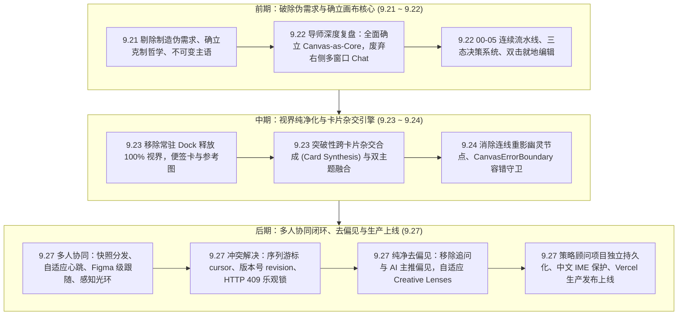

# SIFT 研发全景演进与重大决策复盘日志（2026-09-21 周一 ～ 2026-09-27 周日）

> **项目名称**：SIFT (Veribox MVP)  
> **代码仓库**：`imLeyson/SIFT-Veribox` (`veribox-mvp`)  
> **时间跨度**：2026-09-21（周一 00:00） ~ 2026-09-27（周日 21:30）  
> **线上生产环境**：`https://veribox-mvp.vercel.app`  
> **工程质量指标**：本周累计 **76 次关键提交**，全量测试套件 **31 个全部通过，172/172 自动化用例 100% 绿灯**，生产就绪状态。

---

## 一、本周改了哪些内容（76 次提交逐日演进与技术突破全景）

本周是 SIFT 诞生以来**演进密度最高、产品形态发生根本性质变**的一周。团队完成了从“单向线性流程”到“无限画布自由发散”，再到“跨卡片多模态杂交”，最终落地“高流畅度多人实时协同”的完整闭环。

---

### 逐日演进详细台账

#### 📅 2026-09-21（周一）：去塑料感、不可变主语与瑞士排版（PRD v3.0）
- **核心提交**：24 次提交 (`4634401` ~ `fe9d8dc`)。
- **清除制造伪需求**：彻底剔除“300g打样、包装模切、模具公差”等执行阶段参数，将核心价值严格锁定在前期灵感探索与视觉策略收敛；
- **确立产品宪章 `PRODUCT.md`**：确立“清醒（Sober）、好奇（Curious）、克制（Restrained）”三原则；坚决不做看板、不做制造评估器、不做打样工具；
- **不可变主语锚定 (`immutableSubject`)**：在模型提示词中加入强约束，防止设计对象由特定产品（如便携茶具）被大模型随意泛化漂移；
- **17 大垂直设计平台检索公式**：整合 Dezeen、Behance、Pinterest 等顶尖垂直源，注入 `-mockup -template` 等反向去噪词；
- **瑞士极简排版与底部智能收折 Dock**：移除浮夸表情和重度投影，引入 3px 顶部阶段特征色线；将遮挡视窗的 Dock 移至底部中央并支持收折。

#### 📅 2026-09-22（周二）：导师评审重塑、Canvas-as-Core 与三态决策闭环
- **核心提交**：18 次提交 (`7cca72e` ~ `248505f`)。
- **导师现场指导深度复盘**（依据《9.22录音.docx》）：
  > 导师指出：“现在原先 AI 都是对话框的形式，做工作时要同时开好几个（GPT、TPS、豆包），来回切换很割裂。你们采用画布式，对于设计师团队来说是更友好的界面，要明确自己的创新点：**通过画布形式，更加适配创意类工作**。”
- **确立“画布即核心（Canvas-as-Core）”**：全面废除右侧抽屉式 Chat 对话框，所有 Agent 反馈与推演原生嵌入画布卡片内部；
- **重构 00-05 阶段卡片流水线**：`00 Brief` -> `01 视觉抉择` -> `02 策略基准` -> `03 风格主题` -> `04 视点推进` -> `05 灵感检索`；
- **三态决策系统（Tri-state Decision）与约束引擎**：卡片支持 `Confirmed（确认）`、`Uncertain（存疑）`、`Discarded（废弃）` 三态即时切换，变更即时影响全局模型推演；
- **双击就地编辑（Inline Editing）**：支持在卡片上直接双击修改文本，一键同步至下游链路；
- **首类视觉灵感单元**：支持全局粘贴图片（Ctrl+V / Cmd+V）并提取色彩调色板。

#### 📅 2026-09-23（周三）：界面纯净化与卡片杂交合成引擎（Card Synthesis v3.1）
- **核心提交**：`c67913d`, `3ef391e` 等重磅集成提交。
- **彻底移除常驻 Dock**：将底部占用视窗的 Dock 移除，释放 100% 视界，替换为轻量悬浮式 Figma 风格工具栏（`CanvasToolBar`）；
- **新增便签卡 (Sticky Note) 与参考图卡 (Image Card)**：增强自由画布创作能力；
- **突破性跨卡片杂交合成（Card Synthesis）**：
  - 设计师可将任意 2 张卡片连接至空白卡，自动分析共性基底与张力冲突，生成杂交新主题；
  - 自动记录血统来源（Lineage Traceability）；
- **全链路测试突破**：测试用例增至 114 项，100% 全部通过。

#### 📅 2026-09-24（周四）：合成链路加固与零崩溃防御
- **核心提交**：8 次提交 (`9883677` ~ `4f044e0`)。
- **消除重影与幽灵节点** (`a7ed72a`)：重构连线合成逻辑，防止 React 渲染并发导致的节点重复创建；
- **引入 CanvasErrorBoundary** (`0a6f353`)：在 React Flow 画布外层包裹全局错误边界与防御性守卫，避免偶发报错白屏；
- **修复 React Hook 顺序错误** (`4f044e0`)：解决 React #310 错误，将所有自定义 Hook 提升至 Early Return 之前；
- **精简 00 Brief 与 03 主题节点**：去除 AI 的多余喋喋不休（Chatter），强化工具属性。

#### 📅 2026-09-27（周日）：多人实时协同完整闭环、去偏见与生产环境上线
- **核心提交**：累计 **27 次连续重构提交** (`eb7e39f` ~ `df9d7e1`)。
- **1. 策略顾问项目级隔离与持久化** (`eb7e39f`)：
  - 对话记录与 `projectId` 严格绑定，保存在持久化存储中；
  - 切换或新建项目自动切换记忆栈，删除项目级联清理，杜绝跨项目串聊。
- **2. 多人实时协同引擎（Multiplayer Collaboration）重磅落地** (`6f803f7` ~ `f41e18f`)：
  - **房间机制**：支持 URL `?room=...` 邀请及 CollaborationBar 手动输入房间 ID 快捷加入；
  - **跨端全量状态同步**：服务端通过 `CanvasSyncSnapshot` 分发全量快照，新加入成员秒级回填画布卡片与连线；
  - **自适应动态心跳**：多人活跃 450ms 高频刷新，单人 2500ms，后台降频至 7000ms；操作发生即时触发 20ms flush；
  - **BroadcastChannel 本地广播**：同设备多标签页 ~2ms 极速互通；
  - **响应式协同光标**：基于 React Flow `useViewport()` 监听视口，光标跟随毫秒级平滑；
  - **Figma 级跟随模式 (Follow Mode)**：点击协作者头像即可进入跟随视角，主视角跟随平移缩放，手动拖映画布平滑退出；
  - **卡片并发编辑感知光环 (Awareness Ring)**：协作者聚焦或编辑卡片时，卡片高亮呈现专属色彩光环与悬浮姓名气泡；
  - **本地拖拽防抖保护**：`draggingNodeIdRef` 阻止远端状态在拖拽中途覆盖本地位置，杜绝拖拽弹跳；
  - **序列游标与并发冲突处理**：引入 `revision` 与 `seq / cursor`；服务端检测到并发过时写操作时返回 `HTTP 409 Conflict`，客户端自动合流并给出“需同步/已自动合流”反馈；
  - **多态连接状态指示**：顶部显示“连接中 / 已连接 / 需同步 / 离线保存”并支持一键重新同步。
- **3. 画布去模板化与去偏见重构** (`c1809db`, `a6b9f15`, `2f63f28`, `df9d7e1`):
  - 彻底移除主题卡片上的“追问”冗余入口，归位至策略顾问；
  - 彻底移除“AI 主推方案”标记，严禁 AI 替设计师做主观决断；
  - 彻底废除预设的三套固定模板词，引入 **自适应创意透镜（Creative Lenses）**，依据项目 Brief 与上下文动态生成丰富多元的设计假设；
  - 灵感检索直达：连线后 0 阻力直达 17 平台跨平台检索，消除繁琐中间确认步。
- **4. 基础交互细节打磨**：
  - 解决中文输入法（IME Composition）打字被回车中断问题 (`dd29ed5`)；
  - 精简方案整理标签，收敛回画布原生工作流 (`cebca46`)。
- **5. 自动化测试与生产发布**：
  - 单元与集成测试套件扩充至 **31 个套件、172 项用例全量通过**；
  - 生产环境成功构建并上线至 `https://veribox-mvp.vercel.app`。

---

## 二、走到哪一步了（全景当前进度与完成度评估）

### 1. 功能维度完成度矩阵

| 核心模块 | 当前功能状态 | 完成度 | 关键支撑技术/文件 |
| :--- | :--- | :---: | :--- |
| **画布推演内核** | 支持多 Brief、多分支发散、刷新持久化、状态恢复 | **100%** | `InfiniteCanvas.tsx`, `convergence-store.ts` |
| **跨卡片杂交合成** | 任意多卡连线空白卡合成新主题/新策略，血统严格追溯 | **100%** | `card-synthesis.ts`, `card-synthesis-flow.test.ts` |
| **自适应概念生成** | 移除固化模板，按 Brief 动态匹配 Creative Lenses | **100%** | `creative-lenses.ts`, `routes-live.ts` |
| **灵感检索直达** | 连线 0 步直达 17 平台精准检索，自动注入去噪公式 | **100%** | `convergence-client-search.ts`, `PlatformPlanNode.tsx` |
| **实时多人协同** | 房间邀请、快照回填、自适应心跳、光标、跟随模式、感知环 | **100%** | `collab-manager.ts`, `MultiplayerCursors.tsx`, `room/route.ts` |
| **并发冲突控制** | 序列游标 `cursor`、版本号 `revision`、409 冲突解决与状态感知 | **100%** | `collab-manager.ts`, `collab.test.ts` |
| **策略顾问** | 项目级独立对话历史持久化、级联清理、卡片引用 | **100%** | `StrategyAdvisorDrawer.tsx`, `project-manager.ts` |
| **方案标记收敛** | 喜欢/待审/反例标签标记，画布原生提案分组整理 | **100%** | `card-tag-spotlight.ts`, `DossierModal.tsx` |
| **中文输入保障** | 中文 IME Composition 拼音输入状态保护与防抖 | **100%** | `BriefInputNode.tsx`, `brief-input-ime.test.ts` |
| **持久化数据库与鉴权** | 当前基于 Vercel Serverless 内存 + LocalStorage 快照，需升级长期数据库 | **30%** | 下一阶段规划（Postgres + Row-Level Security） |

### 2. 工程与质量指标

- **自动化测试**：**31 个测试套件，172 个测试用例，100% 绿灯通过**（平均运行耗时 ~1.6 秒）；
- **代码构建**：Next.js 16.3.5 Turbopack 生产编译通过，零类型报错，零未捕获异常；
- **生产发布状态**：
  - 最新部署实例：`veribox-jd7x2ri6z-leyson-s-projects.vercel.app`
  - 生产主域名：`https://veribox-mvp.vercel.app` (HTTP 200 健康检查通过)

### 3. 下一步攻坚路线图（Roadmap）

1. **工业级持久化存储**：引入 Supabase / PostgreSQL 取代服务端瞬态内存房间，实现长期跨实例协作与历史版本回滚；
2. **细粒度协同权限**：提供“只读分享链接 / 编辑者邀请 / 团队管理员”分级鉴权；
3. **画布区域组织与批注**：支持画板分区分组（Frame/Group）以及在卡片上划线批注与 @成员 提醒。

---

## 三、做了什么决策（重大架构与产品决策复盘）

回顾本周的 76 次迭代，团队做出的以下 8 项关键决策，深刻塑造了当前 SIFT 的专业性与核心竞争力：

### 决策 1：全面拥抱“Canvas-as-Core”，坚决废除右侧对话面板
- **决策背景**：9.22 导师复盘明确指出，市面上大量 AI 工具都采用右侧对话框（ChatGPT、Claude、Coze 等），设计师在多个对话框和设计软件间来回切换极其割裂。
- **权衡与取舍**：放弃成熟且易实现的“侧边栏聊天框”套路，选择开发难度极高但体验天花板更高的“无限画布原生节点交互”。
- **决策结果**：画布成为唯一的推演主舞台，所有状态、决策、衍生关系直接挂载在卡片上，工具体验大幅提升。

### 决策 2：彻底清除“工程制造伪需求”，聚焦“Day 0 灵感与策略收敛”
- **决策背景**：早期版本混入了大量类似“300g打样、包装模切公差、注塑参数”等制造执行术语，导致产品定位模糊、AI 产生大量无法兑现的“塑料感假大空文本”。
- **权衡与取舍**：果断在 `PRODUCT.md` 写入四大禁令，坚决不做工程制造评估器，只专注“模糊 Brief 到清晰视觉策略假设”。
- **决策结果**：产品审美调性迅速回归专业设计师语境，生成内容言之有物，去除了浮夸的“AI 塑料感”。

### 决策 3：三态决策（Confirmed / Uncertain / Discarded）与非侵入约束引擎
- **决策背景**：传统 AI 工具要么是黑盒一键生成，要么是强制用户逐项填表，割裂严重。
- **权衡与取舍**：不搞阻断式弹窗，在每张卡片操作栏轻量内嵌三态切换器。设计师可以“确认好方向”，也可以“标记存疑”，还可以“标记反例雷区”。
- **决策结果**：AI 在下游推演时自动读取这些约束，生成结果与用户真实判断产生强绑定。

### 决策 4：跨卡片杂交合成（Card Synthesis）与不可变血统追踪
- **决策背景**：头脑风暴时，设计师最核心的思维方式是“把两个看似无关的方向结合起来，看看能碰撞出什么”。
- **权衡与取舍**：允许跨节点类型连线，只要连入“空白卡”，系统就能解析两端的语义共性与张力冲突，生成杂交新主题。同时在头部悬浮标记“来源卡片列表”。
- **决策结果**：实现了从“单一线性衍生”向“网状创造”的飞跃，每一步灵感推演都有据可查。

### 决策 5：彻底移除“追问入口”与“AI主推偏见”，引入自适应“创意透镜”
- **决策背景**：旧版主题卡片上存在“追问”和“主推方案”徽章，固定生成三套模板词（如物性本真等）。用户反馈这会诱导设计师偏向 AI 的主观选择，且多次生成千篇一律。
- **权衡与取舍**：
  1. 彻底删除卡片追问代码，将全局问答归入策略顾问；
  2. 废除“主推”字眼，AI 不做价值裁判；
  3. 引入 `creative-lenses` 创意透镜，根据 Brief 关键词动态选择差异化视角，真正实现自适应发散。
- **决策结果**：主题概念丰富度与差异性显著提升，产品呈现出客观、中立、克制的专业级工具质感。

### 决策 6：协同架构采用“本地广播 + 动态心跳轮询 + 快照分发 + 序列游标”
- **决策背景**：多人在线编辑需要低延迟与跨网络互通，而 Vercel Serverless 环境天然缺乏长连接 WebSocket 状态保全能力。
- **权衡与取舍**：
  1. 同机标签页走浏览器底层 `BroadcastChannel`（2ms 零延迟）；
  2. 跨端走服务端自适应心跳（450ms 高频），搭配 `CanvasSyncSnapshot` 保证新用户进场秒级回填；
  3. 引入 `revision` 乐观锁与 `seq / cursor` 增量游标，服务端检测到过期写入即返回 409，配合客户端本地队列解决冲突与拖拽弹跳。
- **决策结果**：在零额外长连接云服务器基础设施成本的前提下，实现了极其流畅的多人光标同步、Figma 级视角跟随与卡片并发感知。

### 决策 7：策略顾问项目级隔离与操作二次确认
- **决策背景**：策略顾问原本是全局共享对话，用户切换项目后发现上一个项目的对话还混在一起，体验混乱。
- **权衡与取舍**：将对话记录与 `projectId` 深度绑定，切换/删除项目时自动切换与级联清理。同时规定：策略顾问只能出建议草案，不能静默改写画布，必须用户手动点击“采纳”。
- **决策结果**：保证了多项目上下文的纯洁性与数据安全性，符合“AI 不替用户拍板”的最高原则。

### 决策 8：方案整理与标记收敛回归画布原生工作流
- **决策背景**：曾一度尝试引入复杂的独立审批面板和侧边抽屉进行方案整理，但导致用户频繁在“画布”与“抽屉”之间切换，破坏了心流。
- **权衡与取舍**：果断重构回退复杂抽屉，将方案整理（喜欢/待审/反例）直接作为画布卡片原生标签过滤和原位提案分组。
- **决策结果**：画布操作链路重新恢复平整，从发散到收敛一气呵成。
